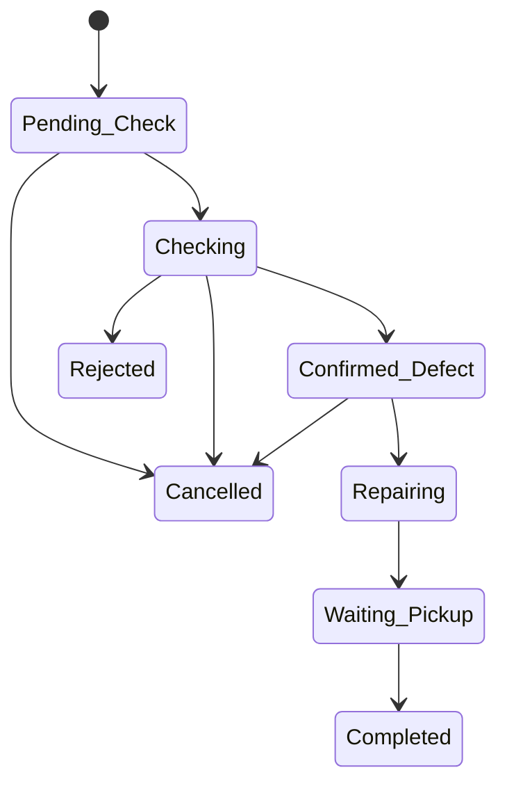

# Admin — Cập nhật trạng thái yêu cầu bảo hành (`PUT /api/admin/warranty-claims/{id}/status`)

Tài liệu tích hợp cho FE / client gọi khi **nhân sự nội bộ** chuyển bước xử lý **WarrantyClaim** (yêu cầu bảo hành) theo pipeline đã định nghĩa trong BE.

---

## 1. Tổng quan


| Thuộc tính       | Giá trị                                                                                                                                                                                                           |
| ---------------- | ----------------------------------------------------------------------------------------------------------------------------------------------------------------------------------------------------------------- |
| **Method**       | `PUT`                                                                                                                                                                                                             |
| **Path**         | `/api/admin/warranty-claims/{id}/status`                                                                                                                                                                          |
| `**{id}`**       | ID số nguyên của bản ghi **WarrantyClaim** (không phải ID phiếu bảo hành `WarrantyTicket`)                                                                                                                        |
| **Auth**         | Bắt buộc — JWT **staff** (`PrincipalKind` = staff), policy `**StaffAuthenticated`** (mọi role nội bộ đã đăng nhập: Admin, Manager, Sales, StockManager, Worker — đối chiếu policy thực tế nếu sau này siết quyền) |
| **Content-Type** | `application/json`                                                                                                                                                                                                |


**Base URL:** theo môi trường (VD `http://localhost:8080`).  
**Envelope response:** `ResponseDto` — `success`, `data`, `message` (và có thể `errorCode`, `errors`, `detail` khi lỗi).

---

## 2. Request

### 2.1. URL ví dụ

```http
PUT /api/admin/warranty-claims/42/status HTTP/1.1
Host: localhost:8080
Authorization: Bearer <staff_jwt>
Content-Type: application/json
Accept: application/json
```

### 2.2. Headers


| Header          | Bắt buộc             | Ghi chú                                                               |
| --------------- | -------------------- | --------------------------------------------------------------------- |
| `Authorization` | **Có**               | `Bearer <access_token>` — đăng nhập nhân sự (`POST /api/Auth/login`). |
| `Content-Type`  | **Có** (khi có body) | `application/json`                                                    |
| `Accept`        | Không                | Khuyến nghị: `application/json`                                       |


### 2.3. Path parameter


| Param | Kiểu    | Mô tả                                                                                                                                                     |
| ----- | ------- | --------------------------------------------------------------------------------------------------------------------------------------------------------- |
| `id`  | integer | ID **claim** (`WarrantyClaims.Id`). Lấy từ `GET /api/admin/warranty-tickets/{ticketId}` (trong `claims[].id`) hoặc `GET /api/admin/warranty-claims/{id}`. |


### 2.4. Body — `AdminWarrantyClaimUpdateStatusDto` (JSON **camelCase**)


| Field           | Kiểu JSON     | Bắt buộc | Mô tả                                                                                                                                   |
| --------------- | ------------- | -------- | --------------------------------------------------------------------------------------------------------------------------------------- |
| `status`        | string        | **Có**   | Trạng thái **mới** (một trong các giá trị chuẩn ở mục 4). So khớng **không phân biệt hoa thường**; BE chuẩn hóa về đúng chuỗi constant. |
| `estimatedCost` | number | null | Không    | Cập nhật chi phí dự kiến nếu gửi.                                                                                                       |
| `resolution`    | string | null | Không    | Kết quả xử lý (nên điền khi chuyển sang **Completed** / **Rejected**).                                                                  |
| `note`          | string | null | Không    | Ghi chú nội bộ bổ sung.                                                                                                                 |


**Ví dụ body — chuyển sang đang kiểm tra**

```json
{
  "status": "Checking"
}
```

**Ví dụ — hoàn tất kèm resolution và cost**

```json
{
  "status": "Completed",
  "estimatedCost": 150000,
  "resolution": "Đã thay linh kiện, test OK.",
  "note": "Khách nhận tại quầy 14:30"
}
```

---

## 3. Response thành công (HTTP 200)


| Field (root) | Kiểu    | Ghi chú                                                 |
| ------------ | ------- | ------------------------------------------------------- |
| `success`    | boolean | `true`                                                  |
| `data`       | object  | `AdminWarrantyClaimDto` — bản ghi claim sau cập nhật    |
| `message`    | string  | VD: *"Cập nhật trạng thái yêu cầu bảo hành thành công"* |


### 3.1. Object `data` — `AdminWarrantyClaimDto`


| Field               | Kiểu                     | Mô tả                                                                                  |
| ------------------- | ------------------------ | -------------------------------------------------------------------------------------- |
| `id`                | number                   | ID claim                                                                               |
| `warrantyTicketId`  | number                   | ID phiếu bảo hành cha                                                                  |
| `variantId`         | number                   | Biến thể                                                                               |
| `sku`               | string                   | SKU                                                                                    |
| `variantName`       | string                   | Tên biến thể                                                                           |
| `productName`       | string                   | Tên sản phẩm                                                                           |
| `imageUrl`          | string | null            | Ảnh variant                                                                            |
| `defectDescription` | string | null            | Mô tả lỗi lúc tạo claim                                                                |
| `imagesUrl`         | string | null            | URL ảnh lỗi (chuỗi gốc)                                                                |
| `status`            | string                   | Trạng thái hiện tại sau `PUT`                                                          |
| `estimatedCost`     | number                   | Chi phí dự kiến (đã merge nếu body gửi `estimatedCost`)                                |
| `createdAt`         | string (ISO 8601)        | Thời điểm tạo claim                                                                    |
| `resolvedDate`      | string | null (ISO 8601) | Được set **UTC “now”** khi `status` ∈ `**Completed*`*, `**Rejected**`, `**Cancelled**` |
| `resolution`        | string | null            |                                                                                        |
| `note`              | string | null            |                                                                                        |


**Ví dụ JSON response (rút gọn)**

```json
{
  "success": true,
  "data": {
    "id": 42,
    "warrantyTicketId": 7,
    "variantId": 101,
    "sku": "SKU-001",
    "variantName": "Đen / L",
    "productName": "Ghế xoay",
    "imageUrl": "https://...",
    "defectDescription": "Bánh xe kêu",
    "imagesUrl": null,
    "status": "Checking",
    "estimatedCost": 0,
    "createdAt": "2026-04-10T08:15:00Z",
    "resolvedDate": null,
    "resolution": null,
    "note": null
  },
  "message": "Cập nhật trạng thái yêu cầu bảo hành thành công",
  "errorCode": null,
  "errors": null
}
```

---

## 4. Giá trị `status` hợp lệ & luồng chuyển

Chuỗi chuẩn (nên hiển thị đúng trên UI / gửi đúng — BE chấp nhận không phân biệt hoa thường rồi chuẩn hóa):


| Giá trị            | Ý nghĩa ngắn              |
| ------------------ | ------------------------- |
| `Pending_Check`    | Chờ kiểm tra              |
| `Checking`         | Đang kiểm tra             |
| `Confirmed_Defect` | Đã xác nhận lỗi — chờ sửa |
| `Repairing`        | Đang sửa                  |
| `Waiting_Pickup`   | Chờ khách nhận            |
| `Completed`        | Hoàn thành                |
| `Rejected`         | Từ chối bảo hành          |
| `Cancelled`        | Đã hủy                    |


**Chuyển trạng thái được phép** (`WarrantyClaimStatuses.CanTransition` — bước tiếp theo phải khớp **một** trong các cạnh sau):


| Từ (`current`)     | Sang (`status` trong body)                  |
| ------------------ | ------------------------------------------- |
| `Pending_Check`    | `Checking`, `Cancelled`                     |
| `Checking`         | `Confirmed_Defect`, `Rejected`, `Cancelled` |
| `Confirmed_Defect` | `Repairing`, `Cancelled`                    |
| `Repairing`        | `Waiting_Pickup`                            |
| `Waiting_Pickup`   | `Completed`                                 |


- **Không** cho nhảy cóc (VD `Pending_Check` → `Repairing`).
- **Không** cho đổi từ terminal: sau khi đã `Completed` / `Rejected` / `Cancelled`, pipeline không định nghĩa bước tiếp — gọi `PUT` chuyển tiếp sẽ **lỗi** (`InvalidOperationException`).




---

## 5. Lỗi thường gặp


| HTTP / tình huống                                          | Nguyên nhân (theo code)                                                                  | Gợi ý FE                                              |
| ---------------------------------------------------------- | ---------------------------------------------------------------------------------------- | ----------------------------------------------------- |
| **401**                                                    | Thiếu / hết hạn JWT staff                                                                | Đăng nhập lại                                         |
| **404**                                                    | `id` không tồn tại                                                                       | Kiểm tra ID claim                                     |
| **400** / envelope `success: false`                        | `status` rỗng hoặc không nằm trong danh sách hợp lệ                                      | Map dropdown đúng constant                            |
| **409** / `CONFLICT` hoặc tương đương (tùy global handler) | `CanTransition` = false (VD từ `Completed` đổi tiếp, hoặc `Pending_Check` → `Repairing`) | Hiển thị `message` từ BE; chỉ bật nút theo bảng mục 4 |


Thông điệp lỗi chuyển trạng thái kiểu: *"Không thể chuyển trạng thái từ 'X' sang 'Y'"*.

---

## 6. Ghi chú tích hợp

1. Trước khi `PUT`, nên `GET /api/admin/warranty-tickets/{id}` hoặc `GET /api/admin/warranty-claims/{id}` để biết `**status` hiện tại** và chỉ enable các nút hợp lệ.
2. Khi chốt `**Completed` / `Rejected` / `Cancelled`**, BE tự gán `**resolvedDate**` = thời điểm server (UTC); không cần gửi trong body.
3. `estimatedCost`, `resolution`, `note`: mỗi field **nếu có trong body và không rỗng** (hoặc có giá trị) thì được cập nhật/ghi đè phần tương ứng (xem `AdminWarrantyService.UpdateClaimStatusAsync`).
4. Liên quan: tạo phiếu / claim — [bao-hanh.md](./bao-hanh.md); danh sách trạng thái tham chiếu — `GET /api/admin/warranty-tickets/statuses`.

