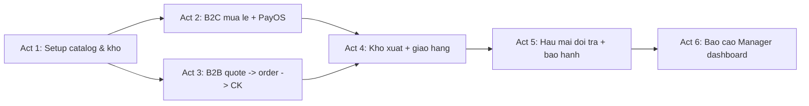

# Kịch bản demo toàn dự án BE_API

Kịch bản **end-to-end** để demo toàn bộ hệ thống: catalog & kho → khách B2C lẻ → khách B2B báo giá → vận hành kho & giao hàng → hậu mãi → báo cáo. Có đầy đủ actor: **Admin, Manager, Sales, StockManager, Worker, Khách B2C, Khách B2B**.

- Thời lượng gợi ý: **45–60 phút**, 6 màn (Act).
- Mỗi Act có **actor chính**, **workspace FE**, **API chính**, **pre-condition**, **post-condition**, **talking points** khi demo.
- Có thể cắt bỏ Act độc lập để demo ngắn hơn.

## Danh sách actor & workspace

| Actor                 | JWT / policy                                                       | Workspace FE                           | README                                                                                             |
| --------------------- | ------------------------------------------------------------------ | -------------------------------------- | -------------------------------------------------------------------------------------------------- |
| Admin                 | staff / `AdminOnly`                                                | Admin                                  | [admin/](./admin/)                                                                                 |
| Manager               | staff / `ManagerOrAdmin` + `WarehouseStaff` + `StaffAuthenticated` | Manager                                | [manager/](./manager/)                                                                             |
| Sales                 | staff / `StaffAuthenticated`                                       | Sales                                  | [sales/](./sales/)                                                                                 |
| StockManager          | staff / `WarehouseStaff` + `StaffAuthenticated`                    | Stock Manager                          | [stockmanager/](./stockmanager/)                                                                   |
| Worker                | staff / `WarehouseStaff`                                           | (dùng chung workspace admin — tab Kho) | [admin/fulfillment.md](./admin/fulfillment.md), [admin/giao-dich-kho.md](./admin/giao-dich-kho.md) |
| Khách B2C             | customer / `CustomerAuthenticated`                                 | Customer B2C                           | [customer/](./customer/)                                                                           |
| Khách B2B             | customer / `CustomerAuthenticated`                                 | B2B Store                              | [b2b/](./b2b/)                                                                                     |

Quy ước endpoint đã diễn giải chi tiết trong từng file md. Tài liệu luồng cơ bản tham chiếu: [kich_ban_b2b_bao_gia_den_ket_thuc_don.md](./kich_ban_b2b_bao_gia_den_ket_thuc_don.md).

Chuẩn bị demo data mẫu: [../b2b_dummy_data.sql](../b2b_dummy_data.sql), [../init_database.sql](../init_database.sql).

---

## Sơ đồ tổng các Act

---

## Act 1 — Setup catalog & nhập kho (Admin + StockManager)

**Mục tiêu demo:** hệ thống hoàn toàn trống (hoặc data mẫu tối thiểu) → có sản phẩm / biến thể / voucher / tồn kho sẵn sàng bán.

**Actor:** Admin (role `admin`), StockManager (role `StockManager`).

### Scene 1.1 — Admin đăng nhập & bootstrap catalog

Workspace: [admin/](./admin/).

| Bước                     | API                                                       | Ghi chú                                      |
| ------------------------ | --------------------------------------------------------- | -------------------------------------------- |
| Admin login              | `POST /api/Auth/login` (username `admin` / mật khẩu seed) | JWT staff, role `admin`                      |
| Tạo danh mục             | `POST /api/admin/categories`                              | [admin/danh-muc.md](./admin/danh-muc.md)     |
| Tạo sản phẩm             | `POST /api/admin/products`                                | Active                                       |
| Upload ảnh               | `POST /api/admin/media/upload`                            | AdminOnly                                    |
| Tạo thuộc tính + giá trị | `POST /api/admin/product-attributes`, `.../values`        |                                              |
| Tạo biến thể (SKU)       | `POST /api/admin/products/{productId}/variants`           | Giá bán lẻ, giá vốn                          |
| Tạo chiến dịch + voucher | `POST /api/admin/campaigns`, `POST /api/admin/vouchers`   | [admin/khuyen-mai.md](./admin/khuyen-mai.md) |

**Talking points:**

- Admin là người duy nhất được vào các API `AdminOnly`.
- Tất cả field JSON theo Swagger; FE workspace admin đã có file md từng module.

### Scene 1.2 — StockManager nhập kho ban đầu

Workspace: admin (tab Kho). Role `StockManager` → policy `WarehouseStaff`.

| Bước                | API                                                      | Ghi chú                                            |
| ------------------- | -------------------------------------------------------- | -------------------------------------------------- |
| Login StockManager  | `POST /api/Auth/login`                                   | JWT staff                                          |
| Xem tồn SKU vừa tạo | `GET /api/admin/products/{pid}/variants/{vid}/inventory` | `QuantityOnHand=0`                                 |
| Nhập kho            | `POST /api/admin/inventory-transactions` type `IN`       | [admin/giao-dich-kho.md](./admin/giao-dich-kho.md) |
| Kiểm lại tồn        | `GET /api/admin/inventory-transactions?variantId=...`    | Quantity cập nhật                                  |

**Post-condition:**

- Danh mục / sản phẩm / variant / tồn kho đầy đủ.
- Voucher `SALE10` khả dụng (ví dụ giảm 10%).
- Demo tiếp Act 2/3.

---

## Act 2 — Khách B2C mua lẻ + thanh toán PayOS

**Mục tiêu demo:** storefront công khai → đăng ký khách → đặt đơn → thanh toán PayOS → theo dõi timeline → reorder lần 2.

**Actor:** Khách B2C (role `Customer` B2C).

### Scene 2.1 — Duyệt catalog (anonymous) & đăng ký

Workspace: [customer/](./customer/).

| Bước                    | API                                    | Ghi chú                                                  |
| ----------------------- | -------------------------------------- | -------------------------------------------------------- |
| Mở trang chủ            | `GET /api/store/categories`            | [customer/catalog.md](./customer/catalog.md)             |
| Duyệt sản phẩm          | `GET /api/store/products?page&search`  |                                                          |
| Xem chi tiết            | `GET /api/store/products/{slugOrId}`   | Variants + giá                                           |
| Đăng ký                 | `POST /api/store/auth/register`        | [customer/auth-va-ho-so.md](./customer/auth-va-ho-so.md) |
| Xem hồ sơ               | `GET /api/store/auth/me`               |                                                          |
| Đổi mật khẩu (tuỳ chọn) | `POST /api/store/auth/change-password` |                                                          |

### Scene 2.2 — Giỏ hàng & checkout PayOS

| Bước                  | API                                                | Ghi chú                                                            |
| --------------------- | -------------------------------------------------- | ------------------------------------------------------------------ |
| Thêm SKU vào giỏ      | `POST /api/store/me/cart/items`                    | [customer/gio-hang.md](./customer/gio-hang.md)                     |
| Chỉnh số lượng        | `PUT /api/store/me/cart/items/{variantId}`         |                                                                    |
| Kiểm tra voucher      | `POST /api/store/vouchers/validate`                | [customer/voucher.md](./customer/voucher.md)                       |
| Thêm địa chỉ giao     | `POST /api/store/me/addresses`                     | [customer/dia-chi-giao-hang.md](./customer/dia-chi-giao-hang.md)   |
| Đặt mặc định          | `POST /api/store/me/addresses/{id}/set-default`    |                                                                    |
| Preview đơn           | `POST /api/store/orders/preview`                   | [customer/dat-don-thanh-toan.md](./customer/dat-don-thanh-toan.md) |
| Đặt đơn PayOS         | `POST /api/store/orders` với `paymentMethod=PayOS` | Trả `orderCode`, `orderStatus=AwaitingPayment`                     |
| Tạo link PayOS        | `POST /api/store/payments/payos/create`            | `checkoutUrl`                                                      |
| Thanh toán trên PayOS | (trang PayOS)                                      | Webhook BE → `paymentStatus=Paid`                                  |
| Webhook BE            | `POST /api/store/payments/payos/webhook`           | Anonymous (PayOS gọi)                                              |

### Scene 2.3 — Theo dõi đơn & reorder

| Bước                   | API                                             | Ghi chú                                                                |
| ---------------------- | ----------------------------------------------- | ---------------------------------------------------------------------- |
| List đơn               | `GET /api/store/me/orders`                      | [customer/don-hang.md](./customer/don-hang.md)                         |
| Chi tiết đơn           | `GET /api/store/me/orders/{orderCode}`          |                                                                        |
| **Timeline**           | `GET /api/store/me/orders/{orderCode}/timeline` | Events: Order, Payment, Invoice (nếu có), Fulfillment sau Act 4        |
| **Hủy (demo từ chối)** | `POST /api/store/me/orders/{orderCode}/cancel`  | Sẽ **409 CONFLICT** nếu đã `Paid` → chỉ demo với đơn `New`/`Confirmed` |
| **Đặt lại**            | `POST /api/store/me/orders/{orderCode}/reorder` | Thêm SKU còn bán vào giỏ                                               |

**Talking points:**

- Timeline là sự kiện **thực từ DB**, không mock (khác với timeline B2B gốc có mock time).
- Reorder khéo xử lý SKU hết tồn / ngừng bán qua `skippedItems`.
- Đơn PayOS có flow **idempotent**: gọi lại `/payos/create` khi link còn hạn sẽ trả cùng `checkoutUrl`.

**Post-condition:** 1 đơn B2C `Paid + Confirmed`, sẵn sàng cho Act 4 (fulfillment).

---

## Act 3 — Khách B2B: báo giá → hợp đồng → đơn → chuyển khoản

**Mục tiêu demo:** luồng bán doanh nghiệp đầy đủ với 5 actor nội bộ + khách.

**Actor:** Khách B2B, Sales, Manager (kiêm kế toán duyệt CK), (tuỳ chọn Admin tạo hợp đồng).

### Scene 3.1 — B2B đăng nhập + gửi yêu cầu báo giá

Workspace: [b2b/](./b2b/).

| Bước                     | API                                   | Ghi chú                                                                      |
| ------------------------ | ------------------------------------- | ---------------------------------------------------------------------------- |
| Login B2B                | `POST /api/store/b2b/auth/login`      | [b2b/auth-dang-ky-dang-nhap-ho-so.md](./b2b/auth-dang-ky-dang-nhap-ho-so.md) |
| Duyệt catalog (tuỳ chọn) | `GET /api/store/products?...`         | Chung catalog B2C                                                            |
| Gửi yêu cầu báo giá      | `POST /api/store/b2b/quotes/requests` | [b2b/bao-gia.md](./b2b/bao-gia.md)                                           |
| Xem báo giá của mình     | `GET /api/store/b2b/quotes`           | Status `Requested`                                                           |

### Scene 3.2 — Sales soạn báo giá

Workspace: [sales/](./sales/).

| Bước                   | API                                      | Ghi chú                                |
| ---------------------- | ---------------------------------------- | -------------------------------------- |
| Login Sales            | `POST /api/Auth/login` (role `Sales`)    |                                        |
| Queue báo giá          | `GET /api/admin/quotes?status=Requested` | [sales/bao-gia.md](./sales/bao-gia.md) |
| Tiếp nhận              | `PUT /api/admin/quotes/{id}/assign`      | `Requested → Draft`                    |
| Soạn dòng + chiết khấu | `PUT /api/admin/quotes/{id}`             | `AdminQuoteUpdateDto`                  |
| Gửi duyệt              | `PUT /api/admin/quotes/{id}/submit`      | `Draft → PendingApproval`              |

### Scene 3.3 — Manager duyệt + khách accept

Workspace: [manager/](./manager/).

| Bước               | API                                            | Ghi chú                                    |
| ------------------ | ---------------------------------------------- | ------------------------------------------ |
| Login Manager      | `POST /api/Auth/login` (role `Manager`)        |                                            |
| Queue duyệt        | `GET /api/admin/quotes?status=PendingApproval` | [manager/bao-gia.md](./manager/bao-gia.md) |
| **Approve**        | `PUT /api/admin/quotes/{id}/approve`           | `ManagerOrAdmin`, `→ Approved`             |
| B2B nhận thông báo | `GET /api/store/b2b/quotes`                    | Hiển thị giá                               |
| B2B accept         | `POST /api/store/b2b/quotes/{id}/accept`       | `→ CustomerAccepted`                       |

### Scene 3.4 (tuỳ chọn) — Hợp đồng

| Bước               | API                                                            | Ghi chú                                  |
| ------------------ | -------------------------------------------------------------- | ---------------------------------------- |
| Sales tạo hợp đồng | `POST /api/admin/contracts` từ `quoteId`                       | [sales/hop-dong.md](./sales/hop-dong.md) |
| Gửi khách xác nhận | `PUT /api/admin/contracts/{id}/send-for-customer-confirmation` |                                          |
| B2B confirm        | `POST /api/store/b2b/contracts/{id}/confirm`                   | `→ Confirmed`                            |

### Scene 3.5 — Chuyển thành đơn + B2B báo CK

| Bước              | API                                            | Ghi chú                                                                   |
| ----------------- | ---------------------------------------------- | ------------------------------------------------------------------------- |
| Sales convert     | `POST /api/admin/quotes/{id}/convert-to-order` | Body gồm `shippingAddressId`, `paymentMethod=BankTransfer`, `contractId?` |
| B2B nhận đơn      | `GET /api/store/b2b/orders/{orderCode}`        | [b2b/don-hang.md](./b2b/don-hang.md)                                      |
| B2B xem hóa đơn   | `GET /api/store/b2b/invoices` (nếu đã xuất HĐ) | [b2b/cong-no-va-hoa-don.md](./b2b/cong-no-va-hoa-don.md)                  |
| **B2B báo đã CK** | `POST /api/store/b2b/payments/notify-transfer` | [b2b/thanh-toan-va-chuyen-khoan.md](./b2b/thanh-toan-va-chuyen-khoan.md)  |

### Scene 3.6 — Manager (kế toán) verify CK

| Bước          | API                                                                    | Ghi chú                                                                             |
| ------------- | ---------------------------------------------------------------------- | ----------------------------------------------------------------------------------- |
| Queue CK      | `GET /api/admin/transfer-notifications?status=Pending`                 | [manager/hoa-don-va-thanh-toan.md](./manager/hoa-don-va-thanh-toan.md)              |
| Đối soát      | `POST /api/admin/transfer-notifications/{id}/verify` với `processNote` | `ManagerOrAdmin`. BE tự tạo `PaymentTransaction` + cập nhật HĐ + giảm `DebtBalance` |
| (hoặc) Reject | `POST .../reject` với `reason`                                         |                                                                                     |

**Post-condition:** đơn B2B ở `Confirmed`, HĐ `Paid` / `PartiallyPaid`, khách B2B không còn công nợ cho đơn này.

---

## Act 4 — Vận hành kho: xuất phiếu & giao hàng

**Mục tiêu demo:** luồng kho từ tạo phiếu → assign worker → Pick → Pack → Ship → đơn tự đồng bộ.

**Actor:** StockManager, Worker, (Manager có thể gán Worker thông qua staff-directory).

### Scene 4.1 — Manager tạo phiếu xuất cho đơn đã Confirmed

Workspace: [manager/kho-va-fulfillment.md](./manager/kho-va-fulfillment.md).

| Bước                         | API                                                        | Ghi chú                                                              |
| ---------------------------- | ---------------------------------------------------------- | -------------------------------------------------------------------- |
| Login Manager / StockManager | `POST /api/Auth/login`                                     |                                                                      |
| Xem đơn `Confirmed`          | `GET /api/admin/orders?orderStatus=Confirmed`              |                                                                      |
| Tạo phiếu xuất               | `POST /api/admin/orders/{orderId}/fulfillments`            | `Pending`                                                            |
| Xem danh sách worker         | `GET /api/admin/staff-directory?role=Worker&status=Active` | [manager/nhan-su-va-phan-cong.md](./manager/nhan-su-va-phan-cong.md) |
| Gán worker                   | `PUT /api/admin/fulfillments/{id}/assign`                  |                                                                      |

### Scene 4.2 — Worker xử lý phiếu

| Bước            | API                                                   | Ghi chú                                  |
| --------------- | ----------------------------------------------------- | ---------------------------------------- |
| Login Worker    | `POST /api/Auth/login` (role `Worker`)                |                                          |
| "Phiếu của tôi" | `GET /api/admin/fulfillments?assignedWorkerId=<me>`   |                                          |
| Pick            | `PUT /api/admin/fulfillments/{id}/status` → `Picking` |                                          |
| Pack            | `PUT /api/admin/fulfillments/{id}/status` → `Packed`  |                                          |
| Ship            | `PUT /api/admin/fulfillments/{id}/status` → `Shipped` | BE tự chuyển đơn `ReadyToShip → Shipped` |

### Scene 4.3 — Khách xác nhận giao hàng thành công

| Bước                               | API                                                 | Actor   |
| ---------------------------------- | --------------------------------------------------- | ------- |
| Manager chuyển đơn `Delivered`     | `PUT /api/admin/orders/{id}/status` với `Delivered` | Manager |
| Khách B2C xem timeline             | `GET /api/store/me/orders/{orderCode}/timeline`     | B2C     |
| Khách B2B xem timeline             | `GET /api/store/b2b/orders/{orderCode}/timeline`    | B2B     |
| Manager đẩy `Completed` (tuỳ chọn) | `PUT /api/admin/orders/{id}/status`                 |         |

**Talking points:**

- `OrderStatuses.CanTransition` quy định thứ tự chặt; UI disable transition không hợp lệ.
- `GET /api/admin/orders/{id}/timeline` (admin) phong phú hơn: có PaymentTransactions, Invoices, TransferNotifications, Return tickets.
- Worker không vào được quote / HĐ / thanh toán.

**Post-condition:** đơn B2C và B2B đều `Delivered` / `Completed`, HĐ `Paid`.

---

## Act 5 — Hậu mãi: đổi / trả + bảo hành

**Mục tiêu demo:** khách yêu cầu đổi trả → Manager duyệt → StockManager hoàn tất → Manager refund.

**Actor:** Khách B2C (hoặc B2B), Manager, StockManager.

### Scene 5.1 — Khách tạo phiếu đổi / trả

| Bước                                                | API                              | Workspace                                              |
| --------------------------------------------------- | -------------------------------- | ------------------------------------------------------ |
| B2C: `POST /api/store/me/return-requests`           | `Return` hoặc `Exchange` + items | [customer/doi-tra-hang.md](./customer/doi-tra-hang.md) |
| B2B: `POST /api/store/b2b/return-exchange-requests` | —                                | [b2b/doi-tra-hang.md](./b2b/doi-tra-hang.md)           |
| Khách theo dõi                                      | `GET /.../return-requests`       | `status=Requested`                                     |

### Scene 5.2 — Manager duyệt phiếu

Workspace: [manager/doi-tra-bao-hanh.md](./manager/doi-tra-bao-hanh.md).

| Bước          | API                                                              | Ghi chú          |
| ------------- | ---------------------------------------------------------------- | ---------------- |
| Queue         | `GET /api/admin/returns?status=Requested`                        |                  |
| Approve       | `PUT /api/admin/returns/{id}/approve` với `refundAmount`, `note` | `ManagerOrAdmin` |
| (hoặc) Reject | `PUT /api/admin/returns/{id}/reject` với `rejectReason`          |                  |

### Scene 5.3 — StockManager complete phiếu

| Bước               | API                                    | Ghi chú                                              |
| ------------------ | -------------------------------------- | ---------------------------------------------------- |
| Login StockManager | —                                      |                                                      |
| Complete phiếu     | `PUT /api/admin/returns/{id}/complete` | Ghi nhận nhập hàng lại (BE tạo InventoryTransaction) |

### Scene 5.4 — Manager hoàn tiền

| Bước             | API                                                                                           | Ghi chú                                |
| ---------------- | --------------------------------------------------------------------------------------------- | -------------------------------------- |
| Queue HĐ         | `GET /api/admin/invoices?customerId=...`                                                      | [admin/hoa-don.md](./admin/hoa-don.md) |
| **Refund**       | `POST /api/admin/payments/refund` với `invoiceId`, `amount`, `paymentMethod`, `referenceCode` | `ManagerOrAdmin`                       |
| Kiểm lại công nợ | `GET /api/admin/customers/{id}/debt`                                                          | (B2B)                                  |

### Scene 5.5 — Khách xem lịch sử + bảo hành

| Bước                       | API                                                                                   | Ghi chú                                                            |
| -------------------------- | ------------------------------------------------------------------------------------- | ------------------------------------------------------------------ |
| B2C xem lịch sử thanh toán | `GET /api/store/me/payments`                                                          | [customer/thanh-toan-lich-su.md](./customer/thanh-toan-lich-su.md) |
| Khách tạo yêu cầu bảo hành | `POST /api/store/me/warranty-tickets` với `orderId`, `variantId`, `defectDescription` | [customer/bao-hanh.md](./customer/bao-hanh.md)                     |
| Xem trạng thái claim       | `GET /api/store/me/warranty-tickets/{ticketNumber}`                                   | `claims[].status`                                                  |
| Manager/Admin update claim | `PUT /api/admin/warranty-claims/{id}/status`                                          | [admin/bao-hanh.md](./admin/bao-hanh.md)                           |

**Post-condition:**

- Phiếu đổi/trả `Completed`, `PaymentTransaction Refund` ghi nhận.
- Công nợ B2B (nếu có) cập nhật.
- Khách có warranty ticket đang theo dõi.

---

## Act 6 — Giám sát & báo cáo (Manager)

**Mục tiêu demo:** Manager đứng ở dashboard xem KPI sau tất cả thao tác trên.

Workspace: [manager/bao-cao.md](./manager/bao-cao.md).

| Bước                | API                                                             | Talking points                                                                                                                                                                         |
| ------------------- | --------------------------------------------------------------- | -------------------------------------------------------------------------------------------------------------------------------------------------------------------------------------- |
| Dashboard tổng quan | `GET /api/admin/reports/sales-overview?fromDate=...&toDate=...` | `netRevenue`, `totalOrderValue`, `orderCount`, `newCustomerCount`, `transferNotificationPendingCount`, `quotePendingApprovalCount`, `invoicesOverdueCount`, `totalUnpaidInvoiceAmount` |
| Tồn thấp            | `GET /api/admin/reports/low-stock?threshold=10&take=100`        | Hiển thị SKU dưới ngưỡng để nhắc StockManager nhập thêm                                                                                                                                |
| Top Sales           | `GET /api/admin/reports/top-sales?fromDate&toDate&limit=10`     | KPI Sales theo doanh thu đơn                                                                                                                                                           |
| Staff directory     | `GET /api/admin/staff-directory?role=Sales`                     | Danh sách để gán công việc                                                                                                                                                             |

**Talking points cuối buổi:**

- Tất cả Act kết nối vào cùng data: sau Act 2/3 → KPI trong Act 6 có số thật.
- Phân quyền `ManagerOrAdmin` đảm bảo Sales/Worker không xem được dashboard.
- Nếu cần thêm KPI: bổ sung endpoint trong `AdminReportsController` (pattern có sẵn).

---

## Ma trận actor × Act (quick reference)

| Actor        | Act 1      | Act 2   | Act 3   | Act 4           | Act 5            | Act 6   |
| ------------ | ---------- | ------- | ------- | --------------- | ---------------- | ------- |
| Admin        | ✅ chính    |         |         |                 |                  | ✅ xem   |
| Manager      |            |         | ✅ duyệt | ✅ điều phối     | ✅ duyệt + refund | ✅ chính |
| Sales        |            |         | ✅ chính |                 |                  |         |
| StockManager | ✅ nhập kho |         |         | ✅ nếu tự assign | ✅ complete       |         |
| Worker       |            |         |         | ✅ chính         |                  |         |
| Khách B2C    |            | ✅ chính |         | ✅ theo dõi      | ✅ đổi/trả + BH   |         |
| Khách B2B    |            |         | ✅ chính | ✅ theo dõi      | ✅ đổi/trả + BH   |         |

---

## Kịch bản rút gọn 20 phút (khi thiếu thời gian)

1. **3′** Act 1 Scene 1.2 (đã có data seed → chỉ demo `GET inventory` + 1 giao dịch IN).
2. **6′** Act 2 Scene 2.2–2.3: B2C đặt đơn + PayOS + timeline.
3. **6′** Act 3 Scene 3.2–3.6: Sales → Manager approve → convert → B2B notify CK → verify.
4. **3′** Act 4 Scene 4.2: Worker pick → pack → ship.
5. **2′** Act 6: mở dashboard Manager, chỉ số đã cập nhật trực tiếp sau demo.

---

## Mẹo chuẩn bị demo

- Seed tài khoản sẵn: 1 Admin, 1 Manager, 2 Sales, 2 Worker, 1 StockManager, 1 B2C, 1 B2B.
- Cache sẵn `orderCode`, `quoteCode`, `ticketNumber`, `invoiceNumber` để copy-paste vào URL.
- Mở **6 tab trình duyệt** (hoặc Postman collection / Swagger) tương ứng 6 actor, mỗi tab đã login JWT tương ứng.
- Làm sẵn script ngắn để:
  1. Reset đơn về trạng thái đầu (xoá hoặc tạo mới).
  2. Clear giỏ B2C trước khi Act 2.
  3. Prefill `notify-transfer` referenceCode.
- Trong khi demo UI, hiển thị **Swagger** song song để thấy endpoint thật đang được gọi.
- Mở file guideline workspace tương ứng (VD [manager/bao-cao.md](./manager/bao-cao.md)) trên màn hình phụ để nhà phát triển biết tên field JSON.

---

## Điểm bổ sung nếu có thêm thời gian

- **Khuyến mãi:** trong Act 2 thêm `voucher.validate` + áp `voucherCode` → nhấn mạnh `discountAmount`.
- **Quên mật khẩu / refresh token:** hiện **chưa có** API, có thể nhắc là roadmap (cần thêm `PasswordResetToken` / `CustomerRefreshToken`).
- **Audit log:** chưa có — nhắc nếu stakeholder hỏi traceability.
- **Review / rating, wishlist, notification feed:** DB chưa hỗ trợ — roadmap.

Hoàn tất kịch bản. Các file guideline workspace được link ngay trong từng Scene để người demo có thể click tra cứu nhanh.