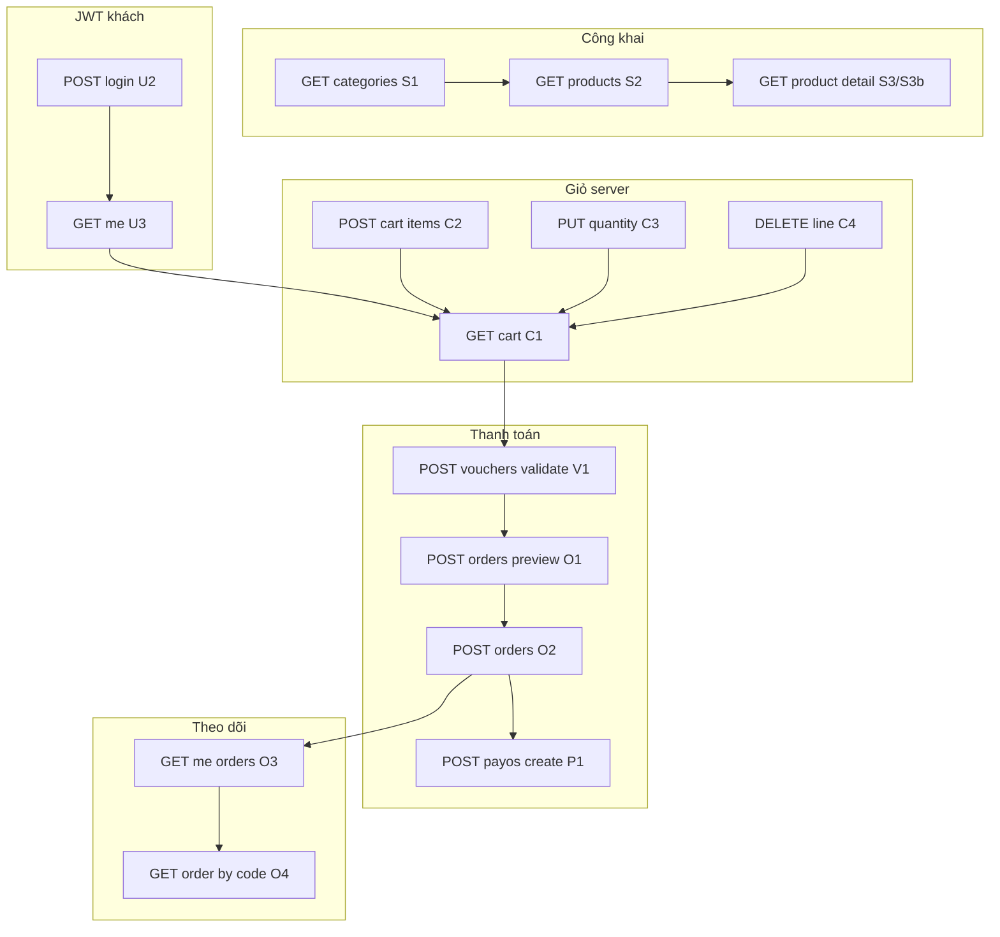

# Kế hoạch Frontend: Khách lẻ (B2C) — Luồng màn hình & logic gọi API

Tài liệu mô tả **cách tổ chức gọi API trên FE** (web/app store) cho khách B2C: thứ tự gọi, điều kiện tiên quyết, đồng bộ trạng thái, xử lý lỗi. Căn cứ trực tiếp vào [`plan_api_khach_le_b2c.md`](plan_api_khach_le_b2c.md), luồng **3.1** (đặt hàng & thanh toán) và **3.5** (voucher) trong [`chi_tiet_nghiep_vu.md`](../chi_tiet_nghiep_vu.md), và envelope [`api_response_va_xu_ly_loi.md`](../api_response_va_xu_ly_loi.md).

**Phạm vi:** chỉ **store B2C** — không gồm admin, không gồm B2B (báo giá/hợp đồng).

**Prefix API:** tài liệu BE gợi ý `api/store/` (hoặc `api/b2c/`). FE nên đọc **base URL** từ biến môi trường (vd. `VITE_API_BASE_URL` / `NEXT_PUBLIC_API_URL`) và ghép path tương đối.

---

## 1. Mục tiêu & nguyên tắc bắt buộc trên FE

### 1.1 Mục tiêu trải nghiệm

- Khách **xem catalog** (danh mục, danh sách, chi tiết, tuỳ chọn quét SKU).
- Khách **đăng ký / đăng nhập**, xem và sửa **profile**.
- Khách **quản lý địa chỉ** giao hàng.
- Khách **thao tác giỏ** trên server (sau khi đăng nhập), **nhập voucher**, **preview** và **đặt hàng**, **theo dõi đơn**.
- (Khi BE bật) **Thanh toán payOS** — tạo link, quay lại site, hiển thị trạng thái thanh toán.

### 1.2 Nguyên tắc kỹ thuật (khớp BE)

| Nguyên tắc | Hành vi FE |
|------------|------------|
| **Một nguồn dòng hàng lúc checkout** | Nguồn dòng cho O1/O2 là **giỏ server** (`ShoppingCarts` / `ShoppingCartItems`). **Không** gửi `items[]` trong body checkout **đồng thời** với giỏ DB. |
| **Không tin tiền trên client** | Mọi tổng tiền, giảm giá, phải trả: lấy từ **O1** / **O2** (hoặc payload giỏ C1 nếu BE trả đủ field). V1 chỉ để **hiển thị gợi ý** trước khi server chốt. |
| **Không tin `customerId` từ URL** | Mọi dữ liệu “của tôi” lấy qua `/me/*` + JWT; không dùng id khách từ query để “xem đơn người khác”. |
| **Sau O2 giỏ bị xóa** | Invalidate/refetch `cart` sau khi đặt hàng thành công; điều hướng sang màn “Đặt hàng thành công” / thanh toán. |

### 1.3 Phạm vi giai đoạn sau (ảnh hưởng FE)

- **Guest checkout** / `items[]` chỉ cho khách chưa đăng nhập — **endpoint tách riêng**; không trộn với giỏ đăng nhập.
- **Giữ chỗ tồn** — có thể thêm cảnh báo/refresh giỏ khi policy đổi.
- **Phí vận chuyển** — O1/O2 mở rộng body/response; FE đọc field mới từ server.

---

## 2. Kiến trúc gợi ý trên FE

### 2.1 HTTP client

- Một instance (axios/fetch wrapper) với `baseURL` trỏ tới API store.
- **Interceptor:** gắn header `Authorization: Bearer <accessToken>` cho mọi request cần policy `CustomerAuthenticated` (giỏ, địa chỉ, preview, đặt hàng, đơn của tôi, payOS create).
- **Chuẩn hóa response:** parse JSON, kiểm tra `success`; nếu `success === false` thì reject hoặc trả `{ errorCode, message, errors }` để UI xử lý thống nhất.

### 2.2 Auth state

- Lưu **access token** (ưu tiên memory; optional `sessionStorage` nếu chấp nhận F5 mất — tuỳ UX).
- Sau **U2 login** thành công: lưu token, gọi **U3 me** (hoặc nhận profile trong body login nếu BE có), **invalidate** toàn bộ query liên quan `me`, `cart`, `addresses`.
- **Logout:** xóa token, xóa cache client, redirect về catalog hoặc home.

### 2.3 Data fetching / cache (React Query, SWR, hoặc tương đương)

Gợi ý **query keys** (điều chỉnh theo framework):

| Key gợi ý | Nguồn | Ghi chú |
|-----------|--------|---------|
| `['store','categories']` | S1 | TTL dài hơn, stale-while-revalidate |
| `['store','products', filters]` | S2 | `filters`: page, pageSize, categoryId, search |
| `['store','product', slugOrId]` | S3 / S3b | Theo param route |
| `['store','variantBySku', sku]` | S4 | Tuỳ tính năng |
| `['store','me']` | U3 | Sau login / sau U4 |
| `['store','addresses']` | D1 | Sau D2–D5 |
| `['store','cart']` | C1 | Sau mọi C2–C5 |
| `['store','orders', page]` | O3 | Phân trang |
| `['store','order', orderCode]` | O4 | Chi tiết đơn |

**Mutations:** sau C2–C5 luôn **invalidate** `['store','cart']`. Sau O2 invalidate `cart` + `orders` + (tuỳ chọn) prefetch O4 cho `orderCode` mới.

### 2.4 Module API theo domain (gợi ý cấu trúc file)

- `api/store/catalog.ts` — S1–S4  
- `api/store/auth.ts` — U1–U4  
- `api/store/addresses.ts` — D1–D5  
- `api/store/cart.ts` — C1–C5  
- `api/store/vouchers.ts` — V1  
- `api/store/orders.ts` — O1–O4  
- `api/store/payments.ts` — P1 (P2 chỉ BE, không gọi từ browser thông thường)

---

## 3. Ánh xạ màn hình / route → API

### 3.1 Công khai (không bắt buộc đăng nhập) — tích hợp chi tiết cho FE

**Chung cho toàn mục 3.1**

| Hạng mục | Giá trị |
|----------|---------|
| **Base URL** | Cấu hình env (vd. `https://api.example.com`) — ghép với path dưới đây. |
| **Policy BE** | `[AllowAnonymous]` — **không bắt buộc** `Authorization`. Có thể gửi kèm Bearer (member) nếu sau này BE dùng optional auth; hiện không ảnh hưởng kết quả catalog. |
| **Method + body** | Toàn bộ 3.1 là **GET**, **không có request body**. |
| **Content-Type** | Không cần gửi body; response JSON `application/json`. |
| **Envelope** | Mọi response bọc [`ResponseDto`](../api_response_va_xu_ly_loi.md): `success`, `data`, `message`, (lỗi) `errorCode`, `errors`. Thuộc tính JSON **camelCase** (vd. `totalCount`, `pageSize`). |
| **Lọc sản phẩm** | Chỉ sản phẩm **`Status = Active`** mới xuất hiện trong S2/S3/S4. |

**Header gợi ý (tuỳ chọn)**

| Header | Bắt buộc | Ghi chú |
|--------|----------|---------|
| `Accept` | Không | Có thể gửi `application/json`. |
| `Authorization` | Không | Catalog công khai. |

---

#### S1 — Cây danh mục (menu cửa hàng)

| Thuộc tính | Giá trị |
|------------|---------|
| **Method** | `GET` |
| **Path** | `/api/store/categories` |
| **Query** | Không. |
| **Path params** | Không. |

**Response `data` (khi `success: true`)**

- Kiểu: mảng cây `CategoryTreeNodeDto[]` (gốc là phần tử top-level, lồng `children`).

| Field (camelCase) | Kiểu | Ý nghĩa |
|-------------------|------|---------|
| `id` | number | Id danh mục. |
| `parentId` | number \| null | Cha; `null` = gốc. |
| `name` | string | Tên hiển thị. |
| `slug` | string | Slug cho URL danh mục / filter. |
| `children` | cùng kiểu | Cây con (đệ quy). |

**If / else nghiệp vụ (FE)**

- **Nếu** `children` rỗng → render leaf (link tới listing với `categoryId=id`).
- **Nếu** cần breadcrumb → duyệt cây theo `parentId` hoặc giữ map `id → node` từ lần load S1.

---

#### S2 — Danh sách sản phẩm (phân trang + lọc)

| Thuộc tính | Giá trị |
|------------|---------|
| **Method** | `GET` |
| **Path** | `/api/store/products` |

**Query parameters** (tất cả optional; BE có default)

| Tên | Kiểu | Default BE | Mô tả |
|-----|------|------------|--------|
| `page` | integer | `1` | Trang, tối thiểu **1** (BE clamp: `< 1` → 1). |
| `pageSize` | integer | `50` | Kích thước trang; BE clamp **1…200** (quá nhỏ → 1, quá lớn → 200). |
| `categoryId` | integer \| bỏ qua | `null` | Lọc theo danh mục. |
| `includeSubcategories` | boolean | `true` | **true**: SP thuộc `categoryId` **và mọi danh mục con** (cây subtree). **false**: chỉ đúng `categoryId` (không con). |
| `search` | string \| bỏ qua | `null` | Chuỗi tìm kiếm; BE `trim()`; nếu sau trim **rỗng** → **bỏ lọc search** (coi như không gửi). |

**If / else nghiệp vụ (BE → FE cần biết)**

- **Nếu** không gửi `categoryId` → liệt kê **toàn bộ** SP Active (vẫn phân trang).
- **Nếu** có `categoryId` **và** `includeSubcategories=true` → BE gom id gốc + id mọi node con trong cây danh mục, lọc `product.categoryId ∈ tập đó`.
- **Nếu** có `categoryId` **và** `includeSubcategories=false` → chỉ `product.categoryId === categoryId`.
- **Nếu** `search` có nội dung → `LIKE` trên **tên sản phẩm** và **slug** (pattern `%term%`).

**Response `data` (khi `success: true`)**

- Kiểu: `PagedResultDto<StoreProductListItemDto>`.

| Field | Kiểu | Ý nghĩa |
|-------|------|---------|
| `items` | array | Danh sách SP. |
| `totalCount` | number | Tổng bản ghi khớp filter (trước phân trang). |
| `page` | number | Trang hiện tại (sau clamp). |
| `pageSize` | number | Kích thước trang (sau clamp). |

**Phần tử `items[]`**

| Field | Kiểu | Ý nghĩa |
|-------|------|---------|
| `id` | number | Id SP. |
| `categoryId` | number | Danh mục. |
| `categoryName` | string | Tên danh mục (hiển thị). |
| `name` | string | Tên SP. |
| `slug` | string | Slug cho link chi tiết S3b. |
| `basePrice` | number \| null | Giá tham chiếu listing (nullable). |
| `warrantyPeriodMonths` | number | Bảo hành (tháng). |
| `variantCount` | number | Số biến thể. |
| `attributeCount` | number | Số nhóm thuộc tính. |

**If / else nghiệp vụ (FE)**

- **Nếu** `items.length === 0` **và** `totalCount === 0` → empty state (không có SP / filter quá chặt).
- **Nếu** `page > ceil(totalCount / pageSize)` và `totalCount > 0` → có thể do user đổi filter; nên reset `page` về 1 khi đổi `categoryId` hoặc `search`.
- **Giá hiển thị card:** listing chỉ có `basePrice`; giá bán lẻ theo biến thể nằm ở **chi tiết S3/S3b** (`variants[].retailPrice`) — **nếu** UX cần “từ X đồng” → quyết định rule UI (vd. min `retailPrice` từ detail hoặc chỉ hiển thị `basePrice`).

---

#### S3 — Chi tiết sản phẩm theo **id số**

| Thuộc tính | Giá trị |
|------------|---------|
| **Method** | `GET` |
| **Path** | `/api/store/products/id/{id}` |
| **Path param** | `id` — integer, bắt buộc trong URL. |

**If / else**

- **Nếu** không tồn tại SP **hoặc** không Active → BE ném `KeyNotFoundException` → HTTP **404**, `success: false`, `errorCode` theo handler (thường `NOT_FOUND`). FE: trang 404 / “Ngừng bán”.

**Response `data`:** cùng cấu trúc **StoreProductDetailDto** như S3b (bảng dưới).

---

#### S3b — Chi tiết sản phẩm theo **slug** hoặc **chuỗi id**

| Thuộc tính | Giá trị |
|------------|---------|
| **Method** | `GET` |
| **Path** | `/api/store/products/{slugOrId}` |
| **Path param** | `slugOrId` — string (một segment). **Bắt buộc URL-encode** nếu slug có ký tự đặc biệt / Unicode. |

**Thứ tự xử lý phía BE (if / else — FE routing nên khớp)**

1. Trim `slugOrId`; **nếu** rỗng sau trim → **400** (`ArgumentException` → `BAD_REQUEST`).
2. **Nếu** parse được **số nguyên** (invariant culture, ví dụ `"42"`) **và** tồn tại SP Active có `id` đó → trả SP đó (**ưu tiên id**).
3. **Ngược lại** → so khớp **`slug` không phân biệt hoa thường** (`ToLowerInvariant`) với slug trong DB.
4. **Nếu** vẫn không có → **404** `NOT_FOUND`.

**Gợi ý FE**

- Route đẹp: `/p/{slug}` → gọi S3b với `slugOrId = slug`.
- Điều hướng nội bộ khi đã biết id: có thể dùng **S3** `/products/id/{id}` để tránh nhầm slug với chuỗi số (vd. slug hợp lệ là `"123"` nhưng không phải id) — **if** slug của SP trùng dạng số, ưu tiên id trên BE có thể khác kỳ vọng UX; khi đó dùng S3 rõ ràng.

**Response `data` — `StoreProductDetailDto`**

| Field | Kiểu | Ý nghĩa |
|-------|------|---------|
| `id` | number | Id SP. |
| `categoryId` | number | Danh mục. |
| `categoryName` | string | Tên danh mục. |
| `name` | string | Tên SP. |
| `slug` | string | Slug. |
| `description` | string \| null | Mô tả HTML/text tuỳ CMS. |
| `basePrice` | number \| null | Giá tham chiếu. |
| `warrantyPeriodMonths` | number | Bảo hành (tháng). |
| `variantCount` | number | Số biến thể. |
| `attributeCount` | number | Số nhóm thuộc tính. |
| `attributes` | array | Thuộc tính + giá trị (filter UI). |
| `variants` | array | Biến thể mua hàng + tồn. |

**`attributes[]` — `ProductDetailAttributeDto`**

| Field | Kiểu |
|-------|------|
| `id` | number |
| `name` | string |
| `values` | `{ id, value }[]` |

**`variants[]` — `StoreProductVariantDto`**

| Field | Kiểu | Ý nghĩa |
|-------|------|---------|
| `id` | number | **VariantId** — dùng cho giỏ C2/C3. |
| `sku` | string | Mã SKU. |
| `variantName` | string | Tên hiển thị. |
| `retailPrice` | number | Giá bán lẻ. |
| `weight` | number \| null | Khối lượng. |
| `dimensions` | string \| null | Kích thước (text). |
| `imageUrl` | string \| null | Ảnh biến thể. |
| `quantityOnHand` | number \| null | Tồn (nếu có inventory). |
| `quantityReserved` | number \| null | Đã giữ. |
| `quantityAvailable` | number \| null | Khả dụng bán. |

**If / else nghiệp vụ (FE — PDP / add to cart)**

- **Nếu** `variants.length === 1` → có thể chọn mặc định variant đó.
- **Nếu** `variants.length > 1` → bắt buộc chọn variant (theo `id`) trước khi thêm giỏ.
- **Nếu** `quantityAvailable === 0` hoặc `null` mà policy UI là “hết hàng” → disable hoặc cảnh báo (O2 vẫn là chốt cứng tồn).
- **Nếu** `quantityAvailable` nhỏ hơn SL user chọn → cảnh báo; vẫn có thể gửi C2 để server trả lỗi/điều chỉnh tùy rule giỏ.

---

#### S4 — Tra cứu biến thể theo SKU (quét mã / nhập SKU)

| Thuộc tính | Giá trị |
|------------|---------|
| **Method** | `GET` |
| **Path** | `/api/store/variants/by-sku/{sku}` |
| **Path** | BE dùng **`{**sku}`** (catch-all) — cho phép SKU chứa `/` hoặc ký tự đặc biệt; **bắt buộc encode path** (`encodeURIComponent(sku)` từng segment hoặc cả chuỗi SKU theo quy ước server). |

**If / else**

- **Nếu** SKU trim rỗng → BE trả **null** → controller coi như không tìm thấy → **404**, message kiểu “Không tìm thấy SKU hoặc sản phẩm không hiển thị”.
- **Nếu** không có variant **hoặc** sản phẩm cha không Active → **404** (như trên).
- So khớp SKU **không phân biệt hoa thường**.

**Response `data` — `StoreVariantSkuDto`**

| Field | Kiểu | Ý nghĩa |
|-------|------|---------|
| `id` | number | VariantId. |
| `productId` | number | Id SP. |
| `productName` | string | Tên SP. |
| `productSlug` | string | Slug → điều hướng S3b. |
| `sku` | string | SKU. |
| `variantName` | string | Tên biến thể. |
| `retailPrice` | number | Giá. |
| `weight` | number \| null | |
| `dimensions` | string \| null | |
| `imageUrl` | string \| null | |
| `quantityOnHand` | number \| null | |
| `quantityReserved` | number \| null | |
| `quantityAvailable` | number \| null | |

**If / else nghiệp vụ (FE)**

- **Nếu** 404 từ S4 → toast “Không tìm thấy mã”; không redirect.
- **Nếu** 200 → **if** cần mở PDP: navigate `/p/{productSlug}` kèm state preselect `variantId = id`; **else if** mua nhanh (sau login): gọi C2 với `variantId`.

---

#### Bảng tóm tắt endpoint mục 3.1

| Mã | Method | Path đầy đủ (tương đối base) |
|----|--------|------------------------------|
| S1 | `GET` | `/api/store/categories` |
| S2 | `GET` | `/api/store/products` |
| S3 | `GET` | `/api/store/products/id/{id}` |
| S3b | `GET` | `/api/store/products/{slugOrId}` |
| S4 | `GET` | `/api/store/variants/by-sku/{sku}` |

**Tham chiếu code BE:** `StoreCategoriesController`, `StoreProductsController`, `StoreVariantLookupController`, `StoreCatalogService`.

### 3.2 Tài khoản

**Tích hợp chi tiết (header, body, JWT, lỗi, if/else):** xem [`tich_hop_store_auth_b2c_fe.md`](tich_hop_store_auth_b2c_fe.md).

| Màn | API | Mã | Hành vi FE |
|-----|-----|-----|------------|
| Đăng ký | `POST api/store/auth/register` | U1 | Validate form client → gọi API → thông báo / auto login / chuyển login |
| Đăng nhập | `POST api/store/auth/login` | U2 | Lưu JWT → refetch `me` + `cart` |
| Profile | `GET api/store/auth/me` | U3 | Guard: nếu có token thì gọi khi vào màn |
| Sửa profile | `PUT api/store/auth/me` | U4 | Sau OK refetch U3 |

### 3.3 Địa chỉ

| Màn / hành động | API | Mã |
|-----------------|-----|-----|
| Danh sách | `GET api/store/me/addresses` | D1 |
| Thêm | `POST api/store/me/addresses` | D2 |
| Sửa | `PUT api/store/me/addresses/{id}` | D3 |
| Xóa | `DELETE api/store/me/addresses/{id}` | D4 |
| Đặt mặc định | `POST api/store/me/addresses/{id}/set-default` | D5 |

**Checkout:** trước O1, đảm bảo user đã chọn một `shippingAddressId` hợp lệ từ danh sách D1 (trừ khi BE cho phép null).

### 3.4 Giỏ hàng (bắt buộc JWT — theo plan hiện tại)

| Hành động | API | Mã |
|-----------|-----|-----|
| Load giỏ | `GET api/store/me/cart` | C1 |
| Thêm / upsert dòng | `POST api/store/me/cart/items` | C2 |
| Đổi số lượng | `PUT api/store/me/cart/items/{variantId}` | C3 |
| Xóa dòng | `DELETE api/store/me/cart/items/{variantId}` | C4 |
| Xóa cả giỏ | `DELETE api/store/me/cart` | C5 |

**Chưa đăng nhập:** không gọi C* — hiển thị CTA đăng nhập; hoặc (sau này) luồng guest riêng.

**Sau mỗi C2–C5 thành công:** refetch C1 hoặc cập nhật optimistic + reconcile với server.

### 3.5 Voucher

| Hành động | API | Mã |
|-----------|-----|-----|
| Kiểm tra mã (UI) | `POST api/store/vouchers/validate` | V1 |

**Body:** theo contract BE (thường `code` + `subTotal` lấy từ giỏ hoặc từ kết quả O1 gần nhất để đồng bộ).

**UX:** debounce nút “Áp dụng”; hiển thị lỗi từ `message` / `errorCode`; khi giỏ thay đổi nên **gọi lại O1** hoặc validate lại nếu mã vẫn được giữ.

### 3.6 Checkout — Preview & đặt hàng

| Bước | API | Mã | Body gợi ý (theo BE) |
|------|-----|-----|------------------------|
| Xem trước đơn | `POST api/store/orders/preview` | O1 | `shippingAddressId?`, `voucherCode?` — **không** gửi `items[]` nếu nguồn là giỏ server |
| Đặt hàng | `POST api/store/orders` | O2 | Giống O1 + `paymentMethod` (+ field bổ sung nếu BE có) |

**Thứ tự khuyến nghị trên màn checkout:**

1. Đảm bảo đã có token và C1 không rỗng.  
2. User chọn `shippingAddressId` (từ D1).  
3. (Tuỳ chọn) Nhập voucher → V1 để hiển thị gợi ý.  
4. **O1** khi đổi địa chỉ / mã voucher / sau khi refetch giỏ — để luôn khớp server.  
5. User bấm “Đặt hàng” → **O2** một lần; chống double-click (disable button, idempotency key nếu BE hỗ trợ sau).  
6. Thành công: lưu `orderCode` (và id nếu có) → clear cache giỏ → chuyển màn thank-you / thanh toán.

**Ánh xạ nghiệp vụ 3.1:** O2 thành công ≈ “đơn mới tạo”; bước tiếp theo là thanh toán (online/COD) theo `paymentMethod` và `PaymentStatus`.

### 3.7 Lịch sử & chi tiết đơn

| Màn | API | Mã |
|-----|-----|-----|
| Danh sách (phân trang) | `GET api/store/me/orders` | O3 |
| Chi tiết | `GET api/store/me/orders/{orderCode}` | O4 |

**FE:** map `OrderStatus`, `PaymentStatus` (chuỗi từ BE) sang badge và timeline; document bảng mapping trong code hoặc i18n.

### 3.8 Thanh toán payOS (FE chỉ P1)

| Hành động | API | Mã |
|-----------|-----|-----|
| Tạo link thanh toán | `POST api/store/payments/payos/create` | P1 |

**Luồng gợi ý:**

1. Sau O2 với `paymentMethod` online: gọi P1 với `orderCode` hoặc `orderId` (theo BE).  
2. Nhận URL → `window.location.assign` hoặc tab mới.  
3. Trang return/cancel (nếu payOS hỗ trợ): điều hướng về O4 hoặc danh sách đơn.  
4. Nếu khách **đóng tab** giữa chừng: đơn vẫn tồn tại; hiển thị nút “Thanh toán lại” → gọi lại P1 khi đơn vẫn `Unpaid` và chưa hủy (theo [`plan_api_khach_le_b2c.md`](plan_api_khach_le_b2c.md) mục 4.6).  
5. Cập nhật `Paid`: do **webhook P2** phía BE; FE có thể **poll O4** hoặc refetch khi user quay lại app.

---

## 4. Sơ đồ luồng tổng thể

---

## 5. Xử lý lỗi & HTTP status (theo BE)

Tham chiếu [`api_response_va_xu_ly_loi.md`](../api_response_va_xu_ly_loi.md).

### 5.1 Body chuẩn `ResponseDto`

| Trường | Thành công | Lỗi |
|--------|------------|-----|
| `success` | `true` | `false` |
| `data` | payload | thường `null` |
| `message` | thông báo | cho người dùng |
| `errorCode` | — | phân nhánh UI |
| `errors` | — | validation: field → mảng message |

**Lưu ý:** Một số response **401** từ JWT middleware có thể **không** bọc `ResponseDto` — FE nên xử lý 401 chung (redirect login, xóa token).

### 5.2 Bảng gợi ý xử lý

| HTTP / `errorCode` (ví dụ) | Hành vi UI gợi ý |
|----------------------------|------------------|
| 400 `VALIDATION_ERROR` | Hiển thị `errors` theo field |
| 401 | Đăng nhập lại |
| 403 `FORBIDDEN` | Thông báo không có quyền |
| 404 `NOT_FOUND` | Không tìm thấy SP/đơn/địa chỉ |
| 409 `CONFLICT` / `DUPLICATE_KEY` | Trùng email, trạng thái không cho phép, v.v. |
| 500 `INTERNAL_ERROR` | Thông báo chung; dev có `traceId` |

### 5.3 Checkout & giỏ

- **O2 lỗi** (tồn không đủ, voucher hết lượt, địa chỉ không thuộc khách): hiển thị `message`, refetch **C1**, gọi lại **O1** nếu cần.  
- **D4 lỗi** (409): địa chỉ đang ràng buộc đơn — không xóa, giữ trong list.

---

## 6. Bảo mật & UX nhanh

- **Không log token** ra console production.  
- **CSRF:** nếu cookie-based auth sau này — bổ sung; hiện tại Bearer token trong header thì chú ý XSS.  
- **Rate limit:** nút đăng ký / validate voucher / đặt hàng nên debounce hoặc cooldown.  
- **Accessibility:** trạng thái loading/error trên từng mutation (giỏ, O2).

---

## 7. Thứ tự triển khai FE (khớp phase BE)

| Phase BE | Việc FE tương ứng |
|----------|-------------------|
| B1 Catalog | Trang categories, listing, detail, optional SKU (S1–S4) |
| B2 Auth | Register, login, me, profile (U1–U4) + route guard |
| B3 Địa chỉ | CRUD + default (D1–D5) |
| B4 Giỏ | PDP add-to-cart, trang giỏ, sync sau login (C1–C5) |
| B5 Đơn | Checkout: V1, O1, O2; danh sách/chi tiết O3–O4 |
| B6 payOS | Màn “Thanh toán”, P1, return URL, refetch O4 |

---

## 8. Liên kết tài liệu

- API B2C (endpoint, policy, giỏ + đơn): [`plan_api_khach_le_b2c.md`](plan_api_khach_le_b2c.md)  
- Nghiệp vụ: [`chi_tiet_nghiep_vu.md`](../chi_tiet_nghiep_vu.md) (3.1, 3.5)  
- Response & lỗi: [`api_response_va_xu_ly_loi.md`](../api_response_va_xu_ly_loi.md)  
- DB: [`DB_EXPLANATION.md`](../DB_EXPLANATION.md)  

---

*Cập nhật file khi BE thêm guest checkout, phí ship, đổi contract O1/O2/P1, hoặc đổi prefix `api/store/`.*
