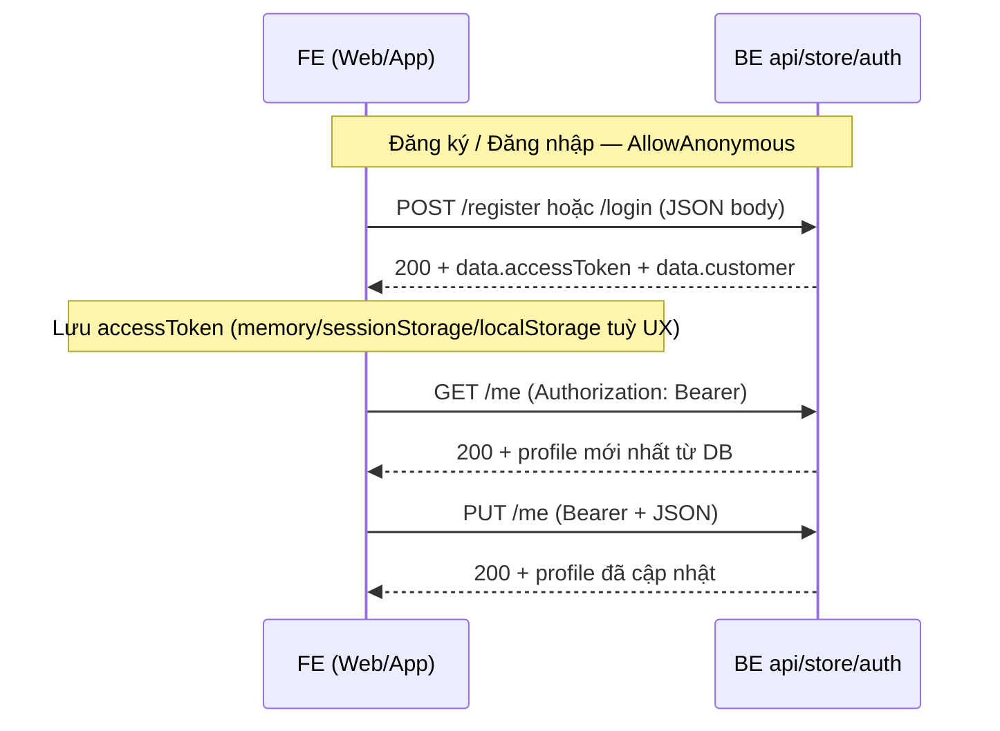

# Luồng tích hợp: Đăng ký / Đăng nhập / Profile — FE cửa hàng B2C

Tài liệu cho **FE team** gọi API khách lẻ (`api/store/auth/`*): header, body JSON, response `data`, lỗi thường gặp và **if/else nghiệp vụ**. Căn cứ code: `StoreAuthController`, `CustomerAuthService`, `JwtTokenService`, policy `CustomerAuthenticated`.

**Liên quan:** envelope `[api_response_va_xu_ly_loi.md](../api_response_va_xu_ly_loi.md)`, tổng quan FE `[plan_fe_khach_le_b2c.md](plan_fe_khach_le_b2c.md)`.

---

## 1. Tổng quan luồng FE

| Bước | Hành động FE                                                                                                                                |
| ---- | ------------------------------------------------------------------------------------------------------------------------------------------- |
| 1    | Gọi **U1** hoặc **U2** → nhận `accessToken` + `customer` + `expiresAtUtc`.                                                                  |
| 2    | Lưu token; mọi request `/me`, giỏ, địa chỉ, đơn… gửi header `Authorization: Bearer` + giá trị token (không có từ `Bearer` trong JSON body). |
| 3    | (Tuỳ chọn) Gọi **U3** sau login để đồng bộ profile với DB.                                                                                  |
| 4    | Khi **401** (hết hạn / sai token / sai loại JWT): xóa token, điều hướng màn đăng nhập.                                                      |

---

## 2. Chung: Base URL, header, envelope

| Hạng mục     | Giá trị                                                                                   |
| ------------ | ----------------------------------------------------------------------------------------- |
| **Base URL** | Cùng origin API (env), ví dụ `https://api.example.com`.                                   |
| **Prefix**   | `/api/store/auth`                                                                         |
| **JSON**     | Request/response **camelCase** (serializer ASP.NET Core mặc định).                        |
| **Envelope** | `ResponseDto`: `success`, `data`, `message`, lỗi thêm `errorCode`, `errors` (validation). |

**Header bắt buộc theo endpoint**

| Endpoint                      | `Content-Type`                   | `Authorization`                                                                   |
| ----------------------------- | -------------------------------- | --------------------------------------------------------------------------------- |
| `POST register`, `POST login` | `application/json`               | **Không** gửi (AllowAnonymous).                                                   |
| `GET me`, `PUT me`            | `application/json` (PUT có body) | `Authorization: Bearer {accessToken}` — bắt buộc; policy `CustomerAuthenticated`. |

**Lưu ý JWT (quan trọng)**

- Token khách phát hành với claim `**principal_kind` = `"customer"`** (xem mục 6).
- Token **nhân sự** (`principal_kind` = `"staff"`) **không** thỏa policy `CustomerAuthenticated` → **403 Forbidden** (authenticated nhưng sai policy), không dùng được cho giỏ/đơn khách.

---

## 3. U1 — Đăng ký (`POST /api/store/auth/register`)

### 3.1 Request

| Thuộc tính | Giá trị                         |
| ---------- | ------------------------------- |
| **Method** | `POST`                          |
| **Path**   | `/api/store/auth/register`      |
| **Body**   | JSON `StoreCustomerRegisterDto` |

**Body — field & validation (DataAnnotations + service)**

| Field (camelCase) | Bắt buộc | Ràng buộc             | Ghi chú BE                                             |
| ----------------- | -------- | --------------------- | ------------------------------------------------------ |
| `fullName`        | Có       | max 500               | Trim khi lưu.                                          |
| `email`           | Có       | email hợp lệ, max 255 | Lưu **chữ thường** (`ToLowerInvariant`).               |
| `phone`           | Có       | max 50                | Trim; **nếu** sau trim rỗng → 400 (ArgumentException). |
| `password`        | Có       | min 6, max 200        |                                                        |

**If / else nghiệp vụ (BE)**

- **Nếu** body không thỏa validation → **400**, `errorCode`: `VALIDATION_ERROR`, `errors` theo tên field.
- **Nếu** `phone` (trim) đã tồn tại (so `Phone.Trim()`) → **409** `CONFLICT`, message kiểu “Số điện thoại đã được đăng ký.”
- **Nếu** `email` (trim, so sánh không phân biệt hoa thường với DB) đã tồn tại → **409** `CONFLICT`, “Email đã được đăng ký.”
- **Nếu** thành công → tạo `Customer` với `customerType` = **B2C**, trả về **cùng shape** như login (JWT + profile).

### 3.2 Response `data` (thành công)

Kiểu: `StoreCustomerLoginResponseDto` (giống U2).

| Field          | Kiểu              | Ý nghĩa                                     |
| -------------- | ----------------- | ------------------------------------------- |
| `accessToken`  | string            | JWT dùng cho Bearer.                        |
| `expiresAtUtc` | string (ISO 8601) | Thời điểm hết hạn (UTC).                    |
| `customer`     | object            | `StoreCustomerProfileDto` — xem bảng mục 5. |

**If / else (FE)**

- **Nếu** `success === true` → lưu `accessToken`, cập nhật UI user từ `customer`, có thể redirect về trang trước hoặc home.
- **Nếu** 409 → hiển thị `message` (email/phone trùng); không lưu token.
- **Nếu** 400 validation → map `errors` lên form.

---

## 4. U2 — Đăng nhập (`POST /api/store/auth/login`)

### 4.1 Request

| Thuộc tính | Giá trị                      |
| ---------- | ---------------------------- |
| **Method** | `POST`                       |
| **Path**   | `/api/store/auth/login`      |
| **Body**   | JSON `StoreCustomerLoginDto` |

| Field (camelCase) | Bắt buộc | Ràng buộc                                         |
| ----------------- | -------- | ------------------------------------------------- |
| `email`           | Có       | email hợp lệ, max 255                             |
| `password`        | Có       | min length 1 (chỉ cần không rỗng theo annotation) |

### 4.2 Logic BE (if / else — ảnh hưởng FE)

- Email **trim**; **nếu** email rỗng sau trim **hoặc** password null/empty → **401** `AUTH_INVALID_CREDENTIALS` (không tiết lộ chi tiết).
- Chỉ tìm khách **B2C** có `Email` khớp (không phân biệt hoa thường) và `**PasswordHash` khác null/rỗng**.
- **Nếu** không tìm thấy hoặc mật khẩu không khớp → **401** `AUTH_INVALID_CREDENTIALS`.

> **Ghi chú triển khai BE:** hiện service đang so khớp mật khẩu **plaintext** với field `PasswordHash` (đoạn BCrypt đang comment). Khi BE chuyển sang BCrypt, **contract JSON cho FE không đổi** — vẫn gửi `password` trong body.

### 4.3 Response `data` (thành công)

Cùng cấu trúc **U1**: `accessToken`, `expiresAtUtc`, `customer`.

**If / else (FE)**

- **Nếu** 401 → toast/inline “Sai email hoặc mật khẩu” (dùng `message` từ body nếu có `ResponseDto`; middleware JWT thuần có thể không bọc envelope — xử lý 401 chung).
- Sau login thành công: **invalidate** cache `me`, `cart`, `addresses` rồi prefetch nếu cần.

---

## 5. Profile trong token response — `StoreCustomerProfileDto`

Dùng cho `data.customer` (U1/U2) và `data` (U3/U4).

| Field (camelCase) | Kiểu          | Ý nghĩa                                                              |
| ----------------- | ------------- | -------------------------------------------------------------------- |
| `id`              | number        | `CustomerId` — không tin từ client để authorize; chỉ hiển thị/debug. |
| `customerType`    | string        | Đăng ký lẻ: **B2C** (theo `CustomerTypes.B2C`).                      |
| `fullName`        | string        | Họ tên.                                                              |
| `email`           | string | null | Email đăng nhập.                                                     |
| `phone`           | string        | Số điện thoại.                                                       |

---

## 6. JWT khách hàng (để debug / kiểm tra token)

FE thường **không cần** decode JWT; chỉ cần gửi Bearer. Khi debug (jwt.io — **chỉ trên môi trường dev**, không lộ production secret):

| Claim            | Giá trị ví dụ    | Ý nghĩa                                      |
| ---------------- | ---------------- | -------------------------------------------- |
| `sub`            | `"123"`          | **Customer id** — BE đọc từ đây cho `/me`.   |
| `unique_name`    | email hoặc phone | Login name (ưu tiên email nếu có).           |
| `full_name`      | string           | Họ tên lúc phát hành token.                  |
| `principal_kind` | `"customer"`     | Bắt buộc cho policy `CustomerAuthenticated`. |

**Issuer / Audience / hết hạn:** cấu hình `Jwt` trong `appsettings` (`Issuer`, `Audience`, `ExpireMinutes`) — token hết hạn sau `ExpireMinutes` kể từ lúc phát hành.

**If / else (FE)**

- **Nếu** `Date.now() >= expiresAtUtc` (hoặc sát hạn) → chủ động gọi lại login hoặc refresh (hiện BE **chưa** có refresh token trong response — chỉ `accessToken`); thực tế: hết hạn → 401 → đăng nhập lại.

---

## 7. U3 — Lấy profile (`GET /api/store/auth/me`)

| Thuộc tính | Giá trị                                                   |
| ---------- | --------------------------------------------------------- |
| **Method** | `GET`                                                     |
| **Path**   | `/api/store/auth/me`                                      |
| **Body**   | Không.                                                    |
| **Auth**   | `Authorization: Bearer {accessToken}` — **Customer JWT**. |

**Response `data`:** một object `StoreCustomerProfileDto` (bảng mục 5).

**If / else**

- **Nếu** token hợp lệ nhưng customer B2C không còn trong DB → **404** `NOT_FOUND`.
- **Nếu** thiếu/sai token → **401** (middleware).
- **Nếu** token **staff** → **403** (sai `principal_kind`).

**Gợi ý FE:** gọi U3 khi app khởi động nếu còn token; sau U4 cũng refetch U3.

---

## 8. U4 — Cập nhật profile (`PUT /api/store/auth/me`)

| Thuộc tính | Giá trị                       |
| ---------- | ----------------------------- |
| **Method** | `PUT`                         |
| **Path**   | `/api/store/auth/me`          |
| **Auth**   | Bearer **customer**.          |
| **Body**   | JSON `StoreCustomerUpdateDto` |

| Field (camelCase) | Bắt buộc | Ràng buộc      |
| ----------------- | -------- | -------------- |
| `fullName`        | Có       | max 500        |
| `email`           | Có       | email, max 255 |
| `phone`           | Có       | max 50         |

**Lưu ý:** U4 **không** đổi mật khẩu trong DTO hiện tại.

**If / else (BE)**

- Validation fail → **400** `VALIDATION_ERROR`.
- Phone/email trim rỗng → **400** `BAD_REQUEST`.
- Email/phone trùng **khách khác** (`id` khác) → **409** `CONFLICT`.
- Không tìm thấy tài khoản B2C → **404**.

**Response `data`:** `StoreCustomerProfileDto` mới.

**FE:** sau thành công cập nhật cache `me`; **lưu ý** nếu user đổi email — token cũ vẫn hợp lệ đến khi hết hạn; `unique_name` trong JWT không tự đổi cho đến lần login sau.

---

## 9. Bảng mã lỗi thường gặp (auth B2C)

| Tình huống                                            | HTTP | `errorCode` (gợi ý)        | Hành vi FE                                   |
| ----------------------------------------------------- | ---- | -------------------------- | -------------------------------------------- |
| Sai email/mật khẩu, email/password rỗng (login)       | 401  | `AUTH_INVALID_CREDENTIALS` | Thông báo chung, không chỉ ra field nào sai. |
| Model validation (register/update/login)              | 400  | `VALIDATION_ERROR`         | Bind `errors` → field.                       |
| Email/phone trùng (register/update)                   | 409  | `CONFLICT`                 | Hiển thị `message`.                          |
| ArgumentException (phone/email không hợp lệ sau trim) | 400  | `BAD_REQUEST`              | Hiển thị `message`.                          |
| Không tìm thấy customer (me)                          | 404  | `NOT_FOUND`                | Logout + thông báo.                          |
| Token staff gọi `/me`                                 | 403  | (tuỳ middleware)           | Không dùng token admin cho store.            |
| Token hết hạn / không hợp lệ                          | 401  | —                          | Logout, redirect login.                      |

Chi tiết map exception: `GlobalExceptionHandler` trong repo.

---

## 10. Checklist tích hợp FE

- `POST register` / `POST login` — không gửi Bearer; parse `data.accessToken`, `data.expiresAtUtc`, `data.customer`.
- Mọi API store “của tôi” — gắn header `Authorization: Bearer` kèm token.
- Phân biệt 401 (đăng nhập lại) vs 403 (sai loại token).
- Sau login/register: refetch hoặc dùng luôn `customer` từ response; optional `GET me`.
- Form đăng ký: min password 6 ký tự (khớp BE).
- Không lưu mật khẩu vào localStorage; chỉ lưu token theo chính sách bảo mật dự án.

---

## 11. Tham chiếu code

| Thành phần   | File                                                                 |
| ------------ | -------------------------------------------------------------------- |
| Controller   | `Controllers/StoreAuthController.cs`                                 |
| Service      | `Service/CustomerAuthService.cs`                                     |
| DTO          | `Dto/Store/StoreCustomer*.cs`                                        |
| JWT khách    | `Service/JwtTokenService.cs` → `CreateCustomerAccessToken`           |
| Policy       | `Authorization/AuthorizationExtensions.cs` → `CustomerAuthenticated` |
| Claim helper | `Authorization/StoreCustomerPrincipal.cs`                            |

---

*Cập nhật khi BE thêm refresh token, đổi endpoint đổi mật khẩu, hoặc bật BCrypt đầy đủ.*