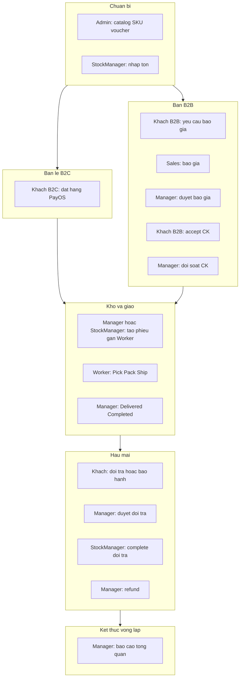

# Luồng demo đầy đủ — vòng đời các actor (tổng quan dự án BE_API)

Tài liệu này mô tả **một phiên demo xuyên suốt** từ lúc hệ thống có hàng bán đến lúc đơn kết thúc và hậu mãi, theo góc nhìn **từng actor**. Backend là REST API ASP.NET Core: nhân viên dùng JWT **staff** (`api/admin/...`, `api/Auth/...`), khách dùng JWT **customer** (`api/store/...`).

Bản **kịch bản từng Act kèm bảng API** đã viết chi tiết trong repo tại: `dev/Documents/guidelineUI/kich_ban_demo_day_du.md` (6 Act, 45–60 phút). File này tập trung **vòng đời vai trò** và **mạch nghiệp vụ tổng thể**, không lặp lại toàn bộ bảng endpoint.

---

## 1. Tổng quan dự án (một đoạn)

Hệ thống quản **bán lẻ (B2C)** và **bán doanh nghiệp (B2B)** trên cùng catalog sản phẩm / biến thể (SKU), có **tồn kho**, **phiếu xuất kho (fulfillment)**, **hóa đơn & thanh toán** (gồm PayOS cho lẻ, chuyển khoản + đối soát cho B2B), **đổi trả**, **bảo hành**, và **báo cáo** cho lãnh đạo. Nội bộ chia role: Admin, Manager, Sales, StockManager, Worker — mỗi role có subset API theo policy JWT.

---

## 2. Danh sách actor và “sân chơi” API

| Actor                   | JWT / nhóm                                              | API chính (prefix)                                                        | Vai trò trong demo                                                                                                  |
| ----------------------- | ------------------------------------------------------- | ------------------------------------------------------------------------- | ------------------------------------------------------------------------------------------------------------------- |
| **Admin**               | staff, policy chặt (`AdminOnly` trên nhiều master data) | `api/admin/...`                                                           | Dựng catalog, sản phẩm, biến thể, khuyến mãi, media; ít xử lý đơn ngày.                                             |
| **Manager**             | staff, `ManagerOrAdmin` + thường có quyền kho           | `api/admin/...`                                                           | Duyệt báo giá, đối soát chuyển khoản, duyệt đổi trả, refund, đổi trạng thái đơn / fulfillment khi cần, xem báo cáo. |
| **Sales**               | staff                                                   | `api/admin/...` (quote, đơn, hợp đồng theo quyền)                         | Tiếp nhận báo giá B2B, soạn giá, chuyển duyệt, chuyển báo giá thành đơn.                                            |
| **StockManager**        | staff, `WarehouseStaff`                                 | `api/admin/...` (kho, fulfillment, tồn, giao dịch kho; **đơn** — mục 2.1) | Nhập/xuất tồn, dashboard kho, **nên xem đơn** để xuất đúng; hoàn tất đổi trả phía kho; phối hợp Worker.             |
| **Worker**              | staff, `WarehouseStaff`                                 | `api/admin/...` (fulfillment được giao)                                   | Pick — Pack — Ship theo phiếu xuất.                                                                                 |
| **Khách B2C**           | customer                                                | `api/store/...`                                                           | Đăng ký, catalog, giỏ, đặt đơn, PayOS, theo dõi đơn, đổi trả / bảo hành.                                            |
| **Khách B2B**           | customer                                                | `api/store/b2b/...`                                                       | Báo giá, nhận báo giá, accept, đơn, hóa đơn, báo chuyển khoản, đổi trả / bảo hành.                                  |
| **Hệ thống / tích hợp** | không đăng nhập người                                   | webhook PayOS, job nội bộ (nếu có)                                        | Cập nhật thanh toán, trạng thái đơn sau thanh toán.                                                                 |

### 2.1 Stock Manager có nên xem đơn hàng không?

- **Nghiệp vụ:** **Nên.** Để lọc đơn sẵn sàng xuất, đối chiếu **dòng hàng + SL** với phiếu fulfillment, xem **địa chỉ giao** và timeline nội bộ — tránh làm kho chỉ trên phiếu mà không có ngữ cảnh đơn.
- **Backend hiện tại:** `AdminOrdersController` dùng `**StaffAuthenticated`** cho phần lớn endpoint — StockManager **được** `GET /api/admin/orders`, `GET /api/admin/orders/{id}`, `GET /api/admin/orders/by-code/{orderCode}`, và `GET .../timeline`. Cùng policy, BE **cũng cho phép** `PUT` đổi trạng thái đơn và trạng thái thanh toán nếu client gọi; **FE có thể ẩn nút** chỉ dành cho Manager, hoặc sau này siết policy ở BE. **Hủy đơn** và **gán Sales** yêu cầu `**ManagerOrAdmin`** — Stock Manager **không** được hai thao tác đó.

**Kế toán / CSKH** trong tài liệu nghiệp vụ thường **gom vào Manager hoặc Admin** trên môi trường demo (chưa tách role riêng trong `AppRoles`).

---

## 3. Sơ đồ một vòng đời chuẩn (tất cả actor chạm vào đâu)

Hai nhánh **B2C** và **B2B** cùng hội tụ vào **kho (fulfillment)** rồi **hậu mãi** và **báo cáo**.

---

## 4. Câu chuyện demo một mạch (thứ tự thời gian)

Dưới đây là **một** chuỗi nghiệp vụ có thể kể trong demo; có thể cắt bớt nhánh B2C hoặc B2B nếu thiếu thời gian.

1. **Admin** đăng nhập staff, tạo danh mục — sản phẩm — biến thể (SKU), cấu hình giá / trạng thái hiển thị, (tuỳ chọn) voucher.
2. **StockManager** đăng nhập, tạo hoặc cập nhật tồn / ghi nhận giao dịch nhập kho để SKU **có `quantityAvailable` đủ bán**.
3. **Khách B2C** (chưa đăng nhập) xem catalog; đăng ký; thêm giỏ; (tuỳ chọn) voucher; đặt đơn **PayOS**; thanh toán; hệ thống/webhook cập nhật đơn **đã thanh toán / xác nhận** tùy luồng BE.
4. **Khách B2B** đăng nhập store B2B, gửi **yêu cầu báo giá** với dòng SKU + số lượng.
5. **Sales** xem queue báo giá, tiếp nhận, soạn giá — chiết khấu — **gửi duyệt**.
6. **Manager** **duyệt** báo giá; **Khách B2B** xem và **accept** báo giá.
7. (Tuỳ chọn demo) **Sales** tạo **hợp đồng** từ báo giá; **Khách B2B** xác nhận hợp đồng.
8. **Sales** **chuyển báo giá thành đơn** (kèm địa chỉ giao, phương thức thanh toán chuyển khoản).
9. **Khách B2B** xem đơn / hóa đơn; **báo đã chuyển khoản** (tạo thông báo CK).
10. **Manager** mở hàng chờ **đối soát chuyển khoản**, **verify** → hệ thống ghi nhận thanh toán, cập nhật hóa đơn / công nợ.
11. **Manager** hoặc **StockManager** xem đơn **Confirmed**, **tạo phiếu fulfillment**, **gán Worker**.
12. **Worker** lấy phiếu được gán, lần lượt **Picking → Packed → Shipped** (xuất kho theo rule BE).
13. **Manager** (hoặc quy trình cho phép) cập nhật đơn **Delivered**; sau đó **Completed** khi nghiệp vụ kết thúc giao hàng.
14. **Khách B2C** / **B2B** xem **timeline** đơn trên store tương ứng.
15. (Hậu mãi) **Khách** tạo **phiếu đổi / trả**; **Manager** **approve** (hoặc reject); **StockManager** **complete** phía kho; **Manager** thực hiện **refund** thanh toán nếu có hoàn tiền.
16. (Hậu mãi) **Khách** tạo **phiếu bảo hành / claim**; nội bộ cập nhật trạng thái claim theo quy trình admin.
17. **Manager** xem **dashboard báo cáo** (doanh thu, tồn thấp, công nợ, … tùy màn đã tích hợp).

Bước 3 và bước 4–14 có thể **song song trong data** (một đơn B2C và một đơn B2B) để Act 4 kho xử lý **hai nguồn đơn** trong cùng demo.

---

## 5. Vòng đời theo từng actor (điểm chạm đầu → cuối)

### Admin

- **Bắt đầu:** bootstrap hệ thống bán hàng (master data không ai khác sửa được trên policy `AdminOnly`).
- **Giữa chừng:** có thể tạo user/role, cấu hình chiến dịch, upload media — tùy kịch bản.
- **Kết thúc vòng bán hàng:** thường **không bắt buộc** tham gia từng đơn; đóng vai “người dựng sân”.

### Manager

- **Bắt đầu:** vào sau khi có báo giá chờ duyệt / CK chờ đối soát / đổi trả chờ duyệt.
- **Giữa chừng:** duyệt báo giá; verify CK; duyệt hoặc từ chối đổi trả; refund; đổi trạng thái đơn & fulfillment khi policy cho phép; tạo phiếu xuất / gán worker nếu demo dùng Manager thay StockManager.
- **Kết thúc:** dashboard tổng quan, theo dõi công nợ / hóa đơn quá hạn.

### Sales

- **Bắt đầu:** khi khách B2B đã gửi yêu cầu báo giá (hoặc lead nội bộ tạo báo giá).
- **Giữa chừng:** soạn báo giá, submit duyệt; sau accept — chuyển báo giá thành đơn; (tuỳ chọn) hợp đồng.
- **Kết thúc:** hand-off sang kho và thanh toán; có thể theo dõi đơn đã gắn `SalesId` tùy UI.

### StockManager

- **Bắt đầu:** ngay sau khi có SKU — nhập tồn / cấu hình tồn / reorder policy (nếu màn hình đã có).
- **Giữa chừng:** overview kho, low-stock, giao dịch kho; **xem đơn** (danh sách / chi tiết / timeline admin) để chọn đơn `Confirmed` rồi tạo fulfillment; phối hợp Worker; **complete** phiếu đổi trả phía kho.
- **Kết thúc:** duy trì tồn và SLA kho sau các đơn và đổi trả.

### Worker

- **Bắt đầu:** khi có phiếu fulfillment **được gán** cho mình.
- **Giữa chừng:** Pick — Pack — Ship.
- **Kết thúc:** không xử lý báo giá / thanh toán; hết phiến thì vòng tạm dừng cho đến đơn mới.

### Khách B2C

- **Bắt đầu:** ẩn danh xem hàng → đăng ký / đăng nhập customer.
- **Giữa chừng:** giỏ — địa chỉ — đặt đơn — thanh toán PayOS — theo dõi đơn / timeline — reorder / hủy (trong điều kiện cho phép).
- **Kết thúc:** nhận hàng (theo trạng thái đơn); đổi trả / bảo hành nếu có vấn đề.

### Khách B2B

- **Bắt đầu:** đăng ký / đăng nhập store B2B.
- **Giữa chừng:** yêu cầu báo giá — theo dõi — accept — nhận đơn — xem hóa đơn — báo CK — theo dõi giao hàng / timeline.
- **Kết thúc:** thanh toán đủ theo hạn; đổi trả / bảo hành giống kênh B2C nhưng API prefix B2B.

### Hệ thống / tích hợp ngoài

- PayOS webhook và luồng idempotent tạo thanh toán / cập nhật đơn.
- Email / thông báo (nếu bật) — không bắt buộc trong demo tối thiểu.

---

## 6. Điều kiện để demo “không vỡ”

- Có **ít nhất một SKU** active và **tồn khả dụng > 0**.
- Tài khoản **từng role** (hoặc ít nhất: Admin, Manager, Sales, StockManager, Worker, 1 B2C, 1 B2B) đã seed hoặc tạo trước.
- PayOS: môi trường demo có credential hợp lệ hoặc mock thanh toán theo hướng dẫn triển khai.
- B2B bank transfer: chuẩn bị 1 kịch bản **notify transfer** + **verify** để đơn không kẹt ở trạng thái chờ tiền.

---

## 7. Khác biệt giữa file này và `kich_ban_demo_day_du.md`

| File này                                                            | `kich_ban_demo_day_du.md`                                              |
| ------------------------------------------------------------------- | ---------------------------------------------------------------------- |
| Vòng đời **theo actor**, một **câu chuyện** xuyên suốt, sơ đồ tổng. | **6 Act**, bảng **API từng bước**, pre/post-condition, talking points. |
| Không liệt kê đầy đủ endpoint.                                      | Dùng để **điều hành buổi demo** và copy path API.                      |

Nếu chỉ cần **một trang** để onboarding hiểu **ai làm gì khi nào**, dùng file này; khi **tích hợp FE / chạy Swagger**, mở `dev/Documents/guidelineUI/kich_ban_demo_day_du.md` và các file guideline trong `dev/Documents/guidelineUI/` theo workspace.