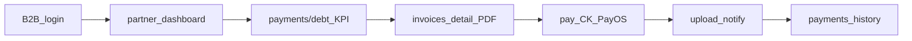

# Demo luồng **Tài chính B2B** (FE + BE)

Ngắn gọn để QA/stakeholder chạy thử các màn **Khách đối tác** (`/partner/payments/*`). Chi tiết API xem [UI/customer-b2b.md](./UI/customer-b2b.md) (mục Tài chính).

---

## Mục tiêu demo

| Màn route | Việc thể hiện |
|-----------|----------------|
| `/partner/payments/debt` | KPI công nợ |
| `/partner/payments/invoices` | Danh sách · chi tiết · PDF |
| `/partner/payments/pay` | Chọn HĐ CK · PayOS đơn |
| `/partner/payments/upload` | Gửi notify CK + file |
| `/partner/payments/history` | `PaymentTransaction` đã ghi nhận |

---

## 1. Môi trường chạy

| Thành phần | Ghi chú |
|------------|---------|
| **FE** (`Macvilla-Customer`) | Node **≥ 20.19**. `npm run dev`. |
| **BE** (`BE_HDGVH`) | Chạy Web API (Swagger ví dụ `http://localhost:5276/swagger`; port có thể khác). |
| API từ FE | Để trống `VITE_API_BASE_URL` → FE gọi `/api/...`; Vite proxy tới `VITE_DEV_PROXY_TARGET` (mặc định `http://localhost:5276`) trong `vite.config.js`. |

---

## 2. Đăng nhập B2B

1. Mở storefront → **Đăng nhập** → tab **Đối tác (B2B)** (`LoginPage.jsx` → `POST /api/store/b2b/auth/login`).
2. Redirect `/partner/dashboard`.
3. Hoặc **`/register/partner`** đăng ký doanh nghiệp trước.

---

## 3. Chuẩn bị dữ liệu tối thiểu (không có seed cố định trong repo)

Repo **không có** seed chuyên cho demo tài chính; dữ liệu là **invoice / order / payment / transfer notification** của **đúng** `CustomerId` đã đăng nhập (thường tạo/ghi nhận qua **Admin / Sales / kế toán** trên BE).

Checklist trước demo:

- [ ] **Ít nhất 1–2** hóa đơn VAT của khách đó **còn tiền phải trả** (`RemainingAmount > 0`).
- [ ] *(Tuỳ chọn PayOS)* Một đơn B2B cùng khách: `paymentMethod = PayOS`, thanh toán đơn còn `Unpaid`, đồng thời cấu hình **`PayOs:*`** đầy đủ trên BE + URL return/cancel hợp lệ.
- [ ] *(Tuỳ chọn Upload)* Cloudinary / upload (`/api/store/me/uploads`) cấu hình để gửi kèm `attachmentUrl`.
- [ ] *(Tuỳ chọn History)* Ít nhất một **`PaymentTransaction`** của khách — thường chỉ có **sau** kế toán **verify** thông báo CK (`TransferNotifications`) hoặc ghi nhận thanh toán nội bộ.

---

## 4. Luồng demo gợi ý (~5–10 phút)

1. **Công nợ** `/partner/payments/debt` — đọc 4 ô tổng (`GET /api/store/b2b/debt/summary`).
2. **Hóa đơn** `/partner/payments/invoices` — lọc `Unpaid` / `PartiallyPaid`, mở chi tiết, tải PDF (`GET …/pdf`).
3. **Thanh toán CK · PayOS** `/partner/payments/pay`:
   - Chọn HĐ có nợ → copy STK/nội dung CK (`GET …/bank-transfer-info`).
   - Hoặc bấm **Thanh toán PayOS** nếu danh sách có đơn khớp (`POST /api/store/payments/payos/create`).
4. **Upload chứng từ** `/partner/payments/upload` — file + mã CK + tiền + tuỳ chọn HĐ; panel phải thấy notify (`GET …/transfer-notifications`).
5. *(Tuỳ)* Phía Admin **verify/reject** thông báo CK để có dòng trong lịch sử giao dịch đã đối soát (`POST /api/admin/transfer-notifications/{id}/verify`). Nếu HĐ có gắn **`OrderId`**, BE còn **đồng bộ `PaymentStatus` đơn** với tổng đã ghi nhận trên các chứng từ đó (xem doc nghiệp vụ B2B backend).
6. **Lịch sử** `/partner/payments/history` — tab loại GD, ngày, chi tiết từng PT (`GET /api/store/b2b/payments/{id}`).

---

## 5. Lưu ý hay vướng

- **PayOS:** Return/cancel phía FE mang `?payosReturn=1` / `?payosCancel=1` về trang pay (xem `PartnerPaymentsPayPage.jsx`).
- **Bank display:** Cấu hình `B2bBankTransfer` trong `appsettings.json` của BE (`GET /api/store/b2b/payments/bank-transfer-info`); nếu chưa cấu hình, FE có fallback tĩnh trong `src/data/b2bDashboard.js`.

---

## 6. Kiểm tra nhanh bằng Swagger

Đăng nhập B2B, lấy Bearer token → `StoreB2BInvoicesController`, `StoreB2BPaymentsController` (Swagger `api/store/b2b/...`). PayOS nhóm `POST /api/store/payments/payos/create`.
