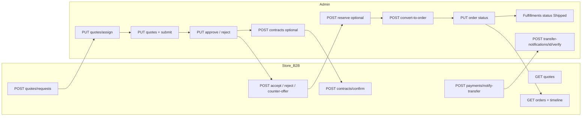
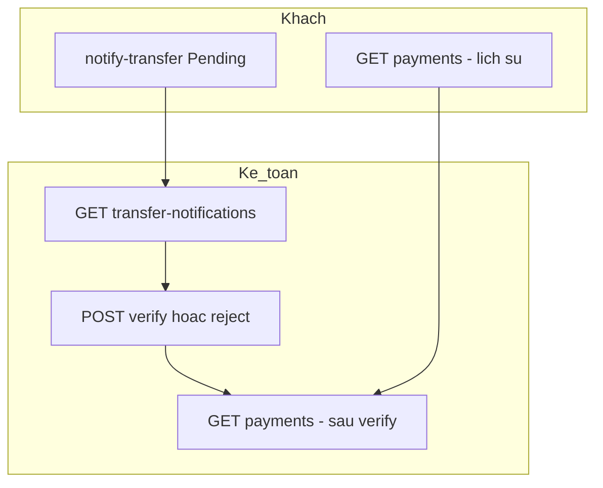

# Kịch bản B2B — Báo giá → đơn → thanh toán → kho → kết thúc (tích hợp UI)

Tài liệu **kịch bản nghiệp vụ** và **chỉ dẫn tích hợp** cho frontend thiết kế luồng màn hình trên `BE_API`, cùng phong cách với [example.md](./example.md), thư mục [admin/](./admin/) và [b2b/](./b2b/).

**Đối tượng:** FE store B2B (JWT khách), FE admin / kho (JWT staff).  
**Chân lý contract:** Swagger `http://localhost:8080/swagger` (hoặc base môi trường + `/swagger`) và OpenAPI `.../swagger/v1/swagger.json`.  
**Envelope:** `ResponseDto` — `success`, `data`, `message` (và `errors` / `errorCode` khi lỗi — xem [../../api_response_va_xu_ly_loi.md](../../api_response_va_xu_ly_loi.md)).  
**JSON:** camelCase. Header `Authorization: Bearer <token>` cho mọi route bảo vệ.  
**Tích hợp HTTP chi tiết:** [tich_hop_api_fe.md](./tich_hop_api_fe.md).

---

## Mục lục

1. [Chuẩn auth & phân quyền](#chuẩn-auth--phân-quyền)
2. [Bảng tra cứu: pha → file guideline chi tiết](#bảng-tra-cứu-pha--file-guideline-chi-tiết)
3. [Pha 1 — Khách B2B: báo giá](#pha-1--khách-b2b-báo-giá)
4. [Pha 2 — Nội bộ: xử lý báo giá](#pha-2--nội-bộ-xử-lý-báo-giá)
5. [Pha 3 (tuỳ chọn) — Hợp đồng B2B](#pha-3-tuỳ-chọn--hợp-đồng-b2b)
6. [Pha 4 (tuỳ chọn) — Giữ tồn theo báo giá](#pha-4-tuỳ-chọn--giữ-tồn-theo-báo-giá)
7. [Pha 5 — Chuyển báo giá thành đơn](#pha-5--chuyển-báo-giá-thành-đơn)
8. [Pha 6 — Đơn hàng, hóa đơn & thanh toán](#pha-6--đơn-hàng-hóa-đơn--thanh-toán)
9. [Pha 7 — Kho & fulfillment](#pha-7--kho--fulfillment)
10. [Pha 8 — Kết thúc & hậu mãi](#pha-8--kết-thúc--hậu-mãi)
11. [Sơ đồ tóm tắt](#sơ-đồ-tóm-tắt)
12. [Checklist tích hợp UI](#checklist-tích-hợp-ui)
13. [Tham chiếu mã nguồn & actor](#tham-chiếu-mã-nguồn--actor)

---

## Chuẩn auth & phân quyền

| Actor                                   | JWT                               | Prefix API                                  | Ghi chú                                                                                           |
| --------------------------------------- | --------------------------------- | ------------------------------------------- | ------------------------------------------------------------------------------------------------- |
| Khách B2B                               | `PrincipalKind: customer`         | `/api/store/b2b/...`                        | Đăng ký / đăng nhập: [b2b/auth-dang-ky-dang-nhap-ho-so.md](./b2b/auth-dang-ky-dang-nhap-ho-so.md) |
| Nội bộ (sales, manager, …)              | `PrincipalKind: staff`            | `/api/admin/...`                            | Nhiều module **StaffAuthenticated**                                                               |
| Kho / fulfillment / một số thao tác tồn | staff + policy **WarehouseStaff** | `/api/admin/fulfillments`, giao dịch kho, … | Vai trò: `admin`, `Manager`, `StockManager`, `Worker` (theo cấu hình policy trong repo)           |

**Không dùng chéo token:** JWT staff cho `api/admin/...`; JWT customer cho `api/store/b2b/...`.

**Trạng thái domain (BE):** `QuoteStatuses`, `ContractStatuses`, `OrderStatuses`, `FulfillmentStatuses`, `TransferNotificationStatuses`, … — đối chiếu Swagger / code khi map màu badge UI.

---

## Bảng tra cứu: pha → file guideline chi tiết

Dùng các file dưới đây cho **bảng field**, **ví dụ JSON**, **query** đầy đủ; file này giữ **luồng tổng thể** và **API chính**.

| Pha / chủ đề                      | Store B2B (`b2b/`)                                                             | Admin (`admin/`)                                                                                                                                 |
| --------------------------------- | ------------------------------------------------------------------------------ | ------------------------------------------------------------------------------------------------------------------------------------------------ |
| Đăng nhập, hồ sơ                  | [auth-dang-ky-dang-nhap-ho-so.md](./b2b/auth-dang-ky-dang-nhap-ho-so.md)       | [auth-va-phien.md](./admin/auth-va-phien.md)                                                                                                     |
| Địa chỉ giao (convert đơn)        | [dia-chi-giao-hang.md](./b2b/dia-chi-giao-hang.md) (`/api/store/me/addresses`) | —                                                                                                                                                |
| Báo giá                           | [bao-gia.md](./b2b/bao-gia.md)                                                 | [bao-gia.md](./admin/bao-gia.md)                                                                                                                 |
| Hợp đồng                          | [hop-dong.md](./b2b/hop-dong.md)                                               | [hop-dong.md](./admin/hop-dong.md)                                                                                                               |
| Đơn + timeline                    | [don-hang.md](./b2b/don-hang.md)                                               | [don-hang.md](./admin/don-hang.md)                                                                                                               |
| Công nợ & hóa đơn (store)         | [cong-no-va-hoa-don.md](./b2b/cong-no-va-hoa-don.md)                           | [hoa-don.md](./admin/hoa-don.md)                                                                                                                 |
| Thanh toán & thông báo CK (store) | [thanh-toan-va-chuyen-khoan.md](./b2b/thanh-toan-va-chuyen-khoan.md)           | [thanh-toan.md](./admin/thanh-toan.md), [thong-bao-chuyen-khoan.md](./admin/thong-bao-chuyen-khoan.md)                                           |
| Kho / phiếu xuất                  | —                                                                              | [fulfillment.md](./admin/fulfillment.md), [giao-dich-kho.md](./admin/giao-dich-kho.md), [bien-the-va-ton-kho.md](./admin/bien-the-va-ton-kho.md) |
| Bảo hành / đổi trả                | [bao-hanh.md](./b2b/bao-hanh.md), [doi-tra-hang.md](./b2b/doi-tra-hang.md)     | [bao-hanh.md](./admin/bao-hanh.md), [doi-tra.md](./admin/doi-tra.md)                                                                             |

**Mục lục thư mục:** [b2b/README.md](./b2b/README.md), [customer/README.md](./customer/README.md), [admin/README.md](./admin/README.md), [sales/README.md](./sales/README.md), [manager/README.md](./manager/README.md) — mỗi workspace là một subset endpoint đúng theo role tương ứng.

---

## Pha 1 — Khách B2B: báo giá

### 1.1 Đăng nhập / đăng ký

| UI gợi ý                  | Hành động                | API                                    |
| ------------------------- | ------------------------ | -------------------------------------- |
| Trang đăng nhập B2B       | Đăng nhập                | `POST /api/store/b2b/auth/login`       |
| Đăng ký doanh nghiệp      | Tạo tài khoản + nhận JWT | `POST /api/store/b2b/auth/register`    |
| Header mọi request sau đó | Gửi token                | `Authorization: Bearer <access_token>` |

Chi tiết field body / response: [b2b/auth-dang-ky-dang-nhap-ho-so.md](./b2b/auth-dang-ky-dang-nhap-ho-so.md).

### 1.2 Gửi yêu cầu báo giá

| UI gợi ý                                          | Hành động | API                                                                    |
| ------------------------------------------------- | --------- | ---------------------------------------------------------------------- |
| Form “Yêu cầu báo giá” (SKU + số lượng + ghi chú) | Gửi       | `POST /api/store/b2b/quotes/requests` — body `StoreB2BQuoteRequestDto` |

**Kết quả:** báo giá trạng thái **Requested**, có `quoteCode`. Thông báo thành công + link “Xem chi tiết”.

Chi tiết: [b2b/bao-gia.md](./b2b/bao-gia.md).

### 1.3 Danh sách & chi tiết

| UI gợi ý          | Hành động               | API                                              |
| ----------------- | ----------------------- | ------------------------------------------------ |
| “Báo giá của tôi” | Danh sách, lọc `status` | `GET /api/store/b2b/quotes?page&pageSize&status` |
| Chi tiết theo mã  | Xem                     | `GET /api/store/b2b/quotes/{quoteCode}`          |

**Trạng thái khách thường thấy:** theo `QuoteStatuses.VisibleToCustomer` — ví dụ `Requested`, `Approved`, `CustomerAccepted`, `CustomerRejected`, `CounterOffer`, `Converted`, `Expired`.

### 1.4 Phản hồi sau khi nội bộ duyệt giá (**Approved**)

| UI gợi ý         | Hành động             | API                                                                              |
| ---------------- | --------------------- | -------------------------------------------------------------------------------- |
| Chi tiết báo giá | Chấp nhận             | `POST /api/store/b2b/quotes/{id}/accept`                                         |
|                  | Từ chối + lý do       | `POST /api/store/b2b/quotes/{id}/reject` — `StoreB2BQuoteRejectDto`              |
|                  | Phản hồi thương lượng | `POST /api/store/b2b/quotes/{id}/counter-offer` — `StoreB2BQuoteCounterOfferDto` |

Sau **accept** → **CustomerAccepted** — điều kiện để nội bộ **chuyển đơn** và (tuỳ chọn) **giữ tồn**.

---

## Pha 2 — Nội bộ: xử lý báo giá

**Auth:** JWT staff — `GET/PUT/POST` dưới `/api/admin/quotes` (**StaffAuthenticated**). Chi tiết DTO / query: [admin/bao-gia.md](./admin/bao-gia.md).

### 2.1 Hàng đợi & tiếp nhận

| UI gợi ý                                                    | Hành động       | API                                                                       |
| ----------------------------------------------------------- | --------------- | ------------------------------------------------------------------------- |
| Danh sách (lọc `status`, `customerId`, `salesId`, tìm kiếm) | Tải             | `GET /api/admin/quotes?...`                                               |
| Chi tiết theo ID / mã                                       | Xem             | `GET /api/admin/quotes/{id}`, `GET /api/admin/quotes/by-code/{quoteCode}` |
| Báo giá **Requested** (hoặc luồng cho phép)                 | Sales tiếp nhận | `PUT /api/admin/quotes/{id}/assign` → **Draft**                           |

### 2.2 Soạn giá & gửi duyệt

| UI gợi ý                                                  | Hành động                      | API                                                       |
| --------------------------------------------------------- | ------------------------------ | --------------------------------------------------------- |
| Màn hình sửa báo giá (**Draft**)                          | Cập nhật dòng, chiết khấu, hạn | `PUT /api/admin/quotes/{id}` — `AdminQuoteUpdateDto`      |
|                                                           | Gửi Manager duyệt              | `PUT /api/admin/quotes/{id}/submit` → **PendingApproval** |
| Cần sửa lại sau CounterOffer / Rejected / PendingApproval | Về nháp (khi domain cho phép)  | `PUT /api/admin/quotes/{id}/return-to-draft`              |

### 2.3 Duyệt giá (Manager)

| UI gợi ý                             | Hành động       | API                                                         |
| ------------------------------------ | --------------- | ----------------------------------------------------------- |
| Hàng chờ duyệt (**PendingApproval**) | Duyệt           | `PUT /api/admin/quotes/{id}/approve`                        |
|                                      | Từ chối + lý do | `PUT /api/admin/quotes/{id}/reject` — `AdminQuoteRejectDto` |

Sau approve → **Approved** → khách thực hiện pha 1.4.

---

## Pha 3 (tuỳ chọn) — Hợp đồng B2B

**Khi nào cần:** doanh nghiệp ký hợp đồng trước khi giao / thanh toán theo hợp đồng.

**Admin:** [admin/hop-dong.md](./admin/hop-dong.md) — base `/api/admin/contracts` (**StaffAuthenticated**).

| UI gợi ý                                          | Hành động          | API                                                                                                                                                  |
| ------------------------------------------------- | ------------------ | ---------------------------------------------------------------------------------------------------------------------------------------------------- |
| Từ báo giá **Approved** hoặc **CustomerAccepted** | Tạo hợp đồng       | `POST /api/admin/contracts` — `AdminContractCreateDto` (`quoteId`, `sendForCustomerConfirmation`, điều khoản, `validFrom`/`validTo`, file đính kèm…) |
| Hợp đồng **Draft**                                | Sửa                | `PUT /api/admin/contracts/{id}`                                                                                                                      |
|                                                   | Gửi khách xác nhận | `PUT /api/admin/contracts/{id}/send-for-customer-confirmation` → **PendingConfirmation**                                                             |
| Danh sách / chi tiết nội bộ                       | Xem                | `GET /api/admin/contracts`, `GET /api/admin/contracts/{id}`, `GET .../by-number/{n}`                                                                 |
| Hủy                                               | Hủy                | `PUT /api/admin/contracts/{id}/cancel` — `AdminContractCancelDto`                                                                                    |

**Store:** [b2b/hop-dong.md](./b2b/hop-dong.md).

| UI gợi ý                | Hành động | API                                                          |
| ----------------------- | --------- | ------------------------------------------------------------ |
| “Hợp đồng chờ xác nhận” | Danh sách | `GET /api/store/b2b/contracts?...`                           |
| Chi tiết                | Xem       | `GET /api/store/b2b/contracts/{contractNumber}`              |
|                         | Xác nhận  | `POST /api/store/b2b/contracts/{id}/confirm` → **Confirmed** |

**Convert đơn (pha 5):** khi gọi `convert-to-order`, gửi `**contractId`** của hợp đồng đã **Confirmed** hoặc **Active** (theo rule BE hiện tại).

---

## Pha 4 (tuỳ chọn) — Giữ tồn theo báo giá

Sau **CustomerAccepted**, nội bộ có thể giữ tồn trước khi tạo đơn. User thực hiện thường cần quyền kho (**WarehouseStaff** hoặc policy tương đương — kiểm Swagger/policy).

| UI gợi ý                            | Hành động                    | API                                                         |
| ----------------------------------- | ---------------------------- | ----------------------------------------------------------- |
| Nút “Giữ tồn” trên chi tiết báo giá | Gọi khi **CustomerAccepted** | `POST /api/admin/quotes/{id}/reserve-inventory`             |
| “Huỷ giữ tồn”                       | Trả reserve                  | `POST /api/admin/quotes/{id}/release-inventory-reservation` |

**Convert đơn:** backend có thể **tự trả reserve** sau khi tạo đơn thành công (theo implementation hiện tại).

Tham chiếu kho: [admin/giao-dich-kho.md](./admin/giao-dich-kho.md), [admin/bao-gia.md](./admin/bao-gia.md).

---

## Pha 5 — Chuyển báo giá thành đơn

| UI gợi ý                              | Hành động                                                                                                                                    | API                                                                            |
| ------------------------------------- | -------------------------------------------------------------------------------------------------------------------------------------------- | ------------------------------------------------------------------------------ |
| Chi tiết báo giá **CustomerAccepted** | Chọn địa chỉ giao (`ShippingAddressId` từ [dia-chi-giao-hang.md](./b2b/dia-chi-giao-hang.md)), phương thức thanh toán; tuỳ chọn `contractId` | `POST /api/admin/quotes/{id}/convert-to-order` — `AdminQuoteConvertToOrderDto` |

**Kết quả:** đơn mới (thường **Confirmed** hoặc trạng thái đầu theo BE), báo giá **Converted**. Hiển thị `orderCode` và link sang màn đơn.

---

## Pha 6 — Đơn hàng, hóa đơn & thanh toán

### 6.1 Khách theo dõi đơn

| UI gợi ý           | Hành động                          | API                                              |
| ------------------ | ---------------------------------- | ------------------------------------------------ |
| Danh sách đơn B2B  | Lọc `orderStatus`, `paymentStatus` | `GET /api/store/b2b/orders?...`                  |
| Chi tiết           | Xem                                | `GET /api/store/b2b/orders/{orderCode}`          |
| Timeline / tiến độ | Xem                                | `GET /api/store/b2b/orders/{orderCode}/timeline` |

Chi tiết: [b2b/don-hang.md](./b2b/don-hang.md).

### 6.2 Nội bộ: đơn hàng

| UI gợi ý                           | Hành động                              | API                                                                       |
| ---------------------------------- | -------------------------------------- | ------------------------------------------------------------------------- |
| Danh sách đơn                      | Lọc trạng thái, khách, sales           | `GET /api/admin/orders?...`                                               |
| Chi tiết / theo mã                 |                                        | `GET /api/admin/orders/{id}`, `GET /api/admin/orders/by-code/{orderCode}` |
| Cập nhật trạng thái đơn            | Theo `OrderStatuses` + rule transition | `PUT /api/admin/orders/{id}/status`                                       |
| Cập nhật trạng thái thanh toán đơn |                                        | `PUT /api/admin/orders/{id}/payment-status`                               |
| Gán sales / huỷ                    |                                        | `PUT .../assign-sales`, `POST .../cancel`                                 |

Chi tiết: [admin/don-hang.md](./admin/don-hang.md).

**Gợi ý pipeline trạng thái (rút gọn):** `New` / `AwaitingPayment` → `Confirmed` → `Processing` → `ReadyToShip` → `Shipped` → `Delivered` → `Completed` (hoặc `Cancelled`). UI nên chỉ bật transition hợp lệ (tránh 409 / lỗi nghiệp vụ).

### 6.3 Hóa đơn & công nợ

Sau khi có hóa đơn (theo nghiệp vụ xuất HĐ của hệ thống):

| Actor     | UI gợi ý                                   | API chính                                                                                                           | Guideline                                            |
| --------- | ------------------------------------------ | ------------------------------------------------------------------------------------------------------------------- | ---------------------------------------------------- |
| Khách B2B | Tổng quan nợ, danh sách / chi tiết HĐ, PDF | `GET /api/store/b2b/debt/summary`, `GET /api/store/b2b/invoices`, `GET .../invoices/{invoiceNumber}`, `GET .../pdf` | [cong-no-va-hoa-don.md](./b2b/cong-no-va-hoa-don.md) |
| Nội bộ    | CRUD / trạng thái hóa đơn admin            | `/api/admin/invoices` (theo Swagger)                                                                                | [hoa-don.md](./admin/hoa-don.md)                     |

### 6.4 Thanh toán — thủ công, thông báo CK & đối soát

Hai luồng bổ sung cho nhau:

1. **Ghi nhận trực tiếp** (sổ quỹ / đối soát không qua form khách): admin dùng `POST /api/admin/payments` (và hoàn: `POST /api/admin/payments/refund`). Chi tiết field: [admin/thanh-toan.md](./admin/thanh-toan.md).
2. **Khách báo đã chuyển khoản** → kế toán xác nhận trên admin:
  - Khách: `POST /api/store/b2b/payments/notify-transfer` — tạo bản ghi thông báo trạng thái **Pending**; xem [b2b/thanh-toan-va-chuyen-khoan.md](./b2b/thanh-toan-va-chuyen-khoan.md).
  - Khách xem lịch sử giao dịch: `GET /api/store/b2b/payments`, `GET /api/store/b2b/payments/{id}` (cùng file guideline).
  - Kế toán: danh sách / chi tiết / **verify** hoặc **reject** — `/api/admin/transfer-notifications` ([admin/thong-bao-chuyen-khoan.md](./admin/thong-bao-chuyen-khoan.md)).
  - **Verify** tạo `PaymentTransaction` (method `BankTransfer`), cập nhật hóa đơn (nếu có) và **công nợ B2B** tương đương ghi nhận thanh toán thủ công; thông báo chuyển **Verified**.

**Gợi ý UI:** màn “Thông báo CK chờ duyệt” (admin) + deep-link từ email / dashboard; sau verify refresh `GET /api/admin/payments` và màn công nợ khách nếu đang mở.

---

## Pha 7 — Kho & fulfillment

**Policy:** thường **WarehouseStaff** — `/api/admin/fulfillments`, `/api/admin/orders/{orderId}/fulfillments`, giao dịch kho.

| UI gợi ý             | Hành động                                   | API                                             |
| -------------------- | ------------------------------------------- | ----------------------------------------------- |
| Danh sách phiếu xuất | Lọc `status`, `orderId`, `assignedWorkerId` | `GET /api/admin/fulfillments?...`               |
| Chi tiết phiếu       |                                             | `GET /api/admin/fulfillments/{id}`              |
| Tạo phiếu cho đơn    | Đơn đã xác nhận, không huỷ                  | `POST /api/admin/orders/{orderId}/fulfillments` |
| Cập nhật phiếu       | Pending → Picking → Packed → **Shipped**    | `PUT /api/admin/fulfillments/{id}/status`       |
| Gán worker           |                                             | `PUT /api/admin/fulfillments/{id}/assign`       |

**Đồng bộ đơn:** khi phiếu **Shipped**, nếu đơn đang **ReadyToShip** thì đơn có thể chuyển **Shipped** (theo rule BE) — UI refresh chi tiết đơn sau khi cập nhật phiếu.

Chi tiết: [admin/fulfillment.md](./admin/fulfillment.md), [admin/giao-dich-kho.md](./admin/giao-dich-kho.md). Worker: list với `assignedWorkerId` = user hiện tại.

---

## Pha 8 — Kết thúc & hậu mãi

| Mục tiêu  | UI / hành động                                                        | API / trạng thái                                                                                                                                                                                                                |
| --------- | --------------------------------------------------------------------- | ------------------------------------------------------------------------------------------------------------------------------------------------------------------------------------------------------------------------------- |
| Giao xong | Nội bộ đẩy đơn **Delivered** (sau **Shipped** nếu có bước vận chuyển) | `PUT /api/admin/orders/{id}/status`                                                                                                                                                                                             |
| Hoàn tất  | **Completed** (transition từ **Delivered** khi rule cho phép)         | Cùng API status                                                                                                                                                                                                                 |
| Hậu mãi   | Bảo hành / đổi trả                                                    | `api/admin/warranty-tickets`, `api/admin/returns` — [admin/bao-hanh.md](./admin/bao-hanh.md), [admin/doi-tra.md](./admin/doi-tra.md); store: [b2b/bao-hanh.md](./b2b/bao-hanh.md), [b2b/doi-tra-hang.md](./b2b/doi-tra-hang.md) |

---

## Sơ đồ tóm tắt

### Luồng báo giá → đơn → kho (rút gọn)

### Tiền tệ (song song với vận hành đơn)

---

## Checklist tích hợp UI

1. [ ] **Store B2B:** đăng ký / đăng nhập → lưu JWT → `me` / địa chỉ nếu cần cho convert.
2. [ ] **Store:** form yêu cầu báo giá → list/detail quote → accept / reject / counter-offer.
3. [ ] **Admin:** list quote → assign → edit draft → submit → approve (Manager).
4. [ ] **(Tuỳ chọn)** Admin tạo hợp đồng → gửi khách → store confirm → truyền `contractId` khi convert.
5. [ ] **(Tuỳ chọn)** Giữ tồn sau **CustomerAccepted**; huỷ giữ khi cần.
6. [ ] **Admin:** `convert-to-order` với `shippingAddressId`, `paymentMethod`, `contractId?`.
7. [ ] **Admin + Store:** cập nhật / hiển thị `orderStatus`, `paymentStatus`; timeline đơn.
8. [ ] **Store:** công nợ + hóa đơn + PDF; **notify-transfer** khi khách CK.
9. [ ] **Admin:** hàng đợi **transfer-notifications** → verify / reject; đồng bộ với list **payments** và hóa đơn.
10. [ ] **Admin:** ghi nhận thanh toán / hoàn thủ công khi không qua notify-transfer ([thanh-toan.md](./admin/thanh-toan.md)).
11. [ ] **Warehouse:** tạo fulfillment → cập nhật trạng thái phiếu → khi **Shipped** refresh đơn.
12. [ ] **Hoàn tất:** **Delivered** / **Completed**; luồng huỷ nếu có; hậu mãi bảo hành / đổi trả nếu phạm vi dự án có.

---

## Tham chiếu mã nguồn & actor

- Actor & phân quyền tổng quan: [../actors.md](../actors.md) (nếu có trong repo).
- Controller tiêu biểu: `StoreB2BAuthController`, `StoreB2BQuotesController`, `StoreB2BContractsController`, `StoreB2BOrdersController`, `StoreB2BPaymentsController`, `AdminQuotesController`, `AdminContractsController`, `AdminOrdersController`, `AdminFulfillmentsController`, `AdminPaymentsController`, `AdminTransferNotificationsController`.

*Nếu cần bản song ngữ hoặc file wireframe theo màn hình, có thể nhân bản cấu trúc mục và giữ bảng tra cứu guideline làm index.*